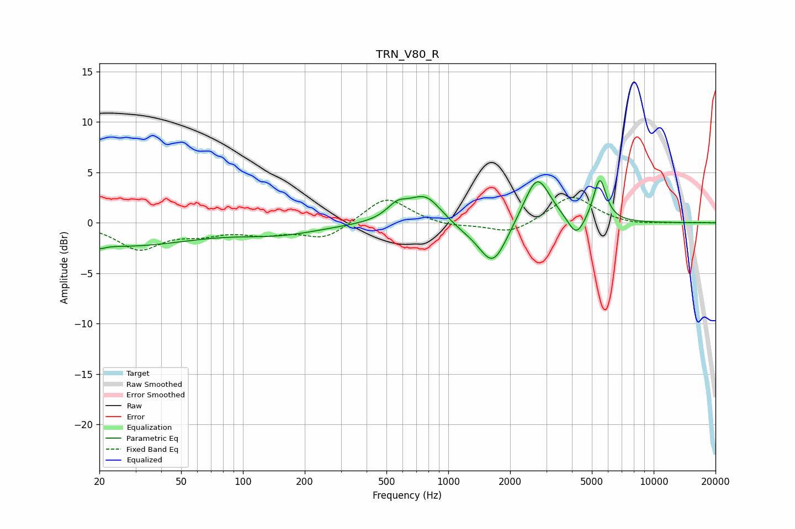

# TRN_V80_R
See [usage instructions](https://github.com/jaakkopasanen/AutoEq#usage) for more options and info.

### Parametric EQs
Apply preamp of -4.3 dB when using parametric equalizer.

|   # | Type    |   Fc (Hz) |    Q |   Gain (dB) |
|-----|---------|-----------|------|-------------|
|   1 | Peaking |        20 | 5.38 |        -0.4 |
|   2 | Peaking |        26 | 0.41 |        -2.2 |
|   3 | Peaking |       152 | 0.7  |        -1   |
|   4 | Peaking |       564 | 2.75 |         1.3 |
|   5 | Peaking |       777 | 1.7  |         2.9 |
|   6 | Peaking |      1164 | 1.25 |        -0.7 |
|   7 | Peaking |      1651 | 2.08 |        -4.2 |
|   8 | Peaking |      2705 | 2.2  |         4.9 |
|   9 | Peaking |      4201 | 3.52 |        -2.1 |
|  10 | Peaking |      5466 | 4.47 |         4.3 |

### Fixed Band EQs
When using fixed band (also called graphic) equalizer, apply preamp of **-2.6 dB** (if available) and set gains manually with these parameters.

|   # | Type    |   Fc (Hz) |    Q |   Gain (dB) |
|-----|---------|-----------|------|-------------|
|   1 | Peaking |        31 | 1.41 |        -2.5 |
|   2 | Peaking |        62 | 1.41 |        -0.9 |
|   3 | Peaking |       125 | 1.41 |        -0.9 |
|   4 | Peaking |       250 | 1.41 |        -1.6 |
|   5 | Peaking |       500 | 1.41 |         2.7 |
|   6 | Peaking |      1000 | 1.41 |        -0.4 |
|   7 | Peaking |      2000 | 1.41 |        -1.2 |
|   8 | Peaking |      4000 | 1.41 |         2.7 |
|   9 | Peaking |      8000 | 1.41 |        -0.2 |
|  10 | Peaking |     16000 | 1.41 |         0   |

### Graphs

