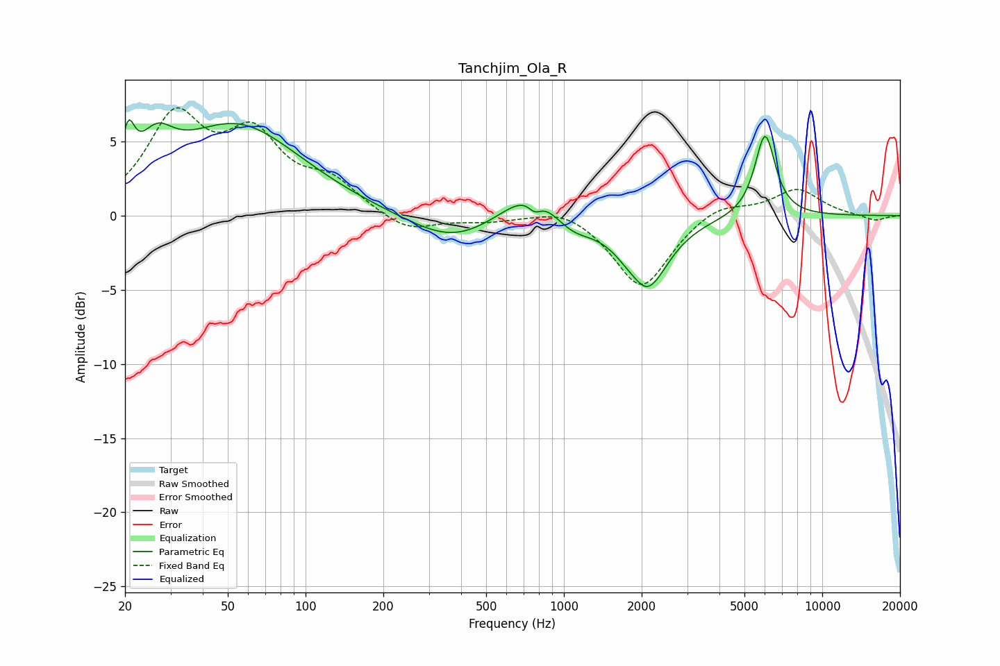

# Tanchjim_Ola_R
See [usage instructions](https://github.com/jaakkopasanen/AutoEq#usage) for more options and info.

### Parametric EQs
Apply preamp of -6.6 dB when using parametric equalizer.

|   # | Type    |   Fc (Hz) |    Q |   Gain (dB) |
|-----|---------|-----------|------|-------------|
|   1 | Peaking |        21 | 5.99 |         2.9 |
|   2 | Peaking |        26 | 2.17 |         2.6 |
|   3 | Peaking |        54 | 0.57 |         6   |
|   4 | Peaking |       372 | 0.83 |        -2   |
|   5 | Peaking |       759 | 1.23 |         2.5 |
|   6 | Peaking |       771 | 5.67 |        -0.7 |
|   7 | Peaking |      1068 | 1.76 |        -1.3 |
|   8 | Peaking |      1918 | 3.84 |         0.4 |
|   9 | Peaking |      2064 | 1.69 |        -5.1 |
|  10 | Peaking |      6007 | 3.47 |         5.6 |

### Fixed Band EQs
When using fixed band (also called graphic) equalizer, apply preamp of **-7.4 dB** (if available) and set gains manually with these parameters.

|   # | Type    |   Fc (Hz) |    Q |   Gain (dB) |
|-----|---------|-----------|------|-------------|
|   1 | Peaking |        31 | 1.41 |         6.3 |
|   2 | Peaking |        62 | 1.41 |         4.8 |
|   3 | Peaking |       125 | 1.41 |         2   |
|   4 | Peaking |       250 | 1.41 |        -1.2 |
|   5 | Peaking |       500 | 1.41 |        -0.3 |
|   6 | Peaking |      1000 | 1.41 |         0.7 |
|   7 | Peaking |      2000 | 1.41 |        -5   |
|   8 | Peaking |      4000 | 1.41 |         0.9 |
|   9 | Peaking |      8000 | 1.41 |         1.8 |
|  10 | Peaking |     16000 | 1.41 |        -0.4 |

### Graphs

