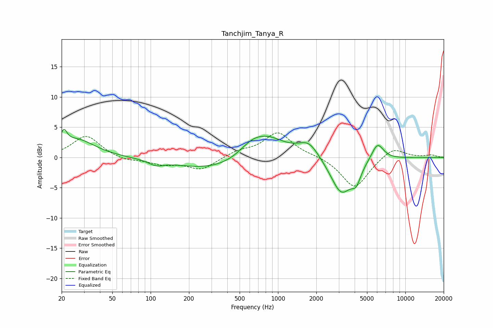

# Tanchjim_Tanya_R
See [usage instructions](https://github.com/jaakkopasanen/AutoEq#usage) for more options and info.

### Parametric EQs
Apply preamp of -4.7 dB when using parametric equalizer.

|   # | Type    |   Fc (Hz) |    Q |   Gain (dB) |
|-----|---------|-----------|------|-------------|
|   1 | Peaking |        21 | 5.87 |         2.3 |
|   2 | Peaking |        26 | 1.01 |         2.9 |
|   3 | Peaking |       110 | 2.46 |        -0.8 |
|   4 | Peaking |       330 | 0.47 |        -2.2 |
|   5 | Peaking |       608 | 1.61 |         1.2 |
|   6 | Peaking |       799 | 0.91 |         3.9 |
|   7 | Peaking |      1746 | 1.75 |         2.5 |
|   8 | Peaking |      3141 | 1.65 |        -6.1 |
|   9 | Peaking |      4113 | 3.85 |        -2.4 |
|  10 | Peaking |      6038 | 2.85 |         2.9 |

### Fixed Band EQs
When using fixed band (also called graphic) equalizer, apply preamp of **-4.2 dB** (if available) and set gains manually with these parameters.

|   # | Type    |   Fc (Hz) |    Q |   Gain (dB) |
|-----|---------|-----------|------|-------------|
|   1 | Peaking |        31 | 1.41 |         3.6 |
|   2 | Peaking |        62 | 1.41 |        -0.6 |
|   3 | Peaking |       125 | 1.41 |        -1   |
|   4 | Peaking |       250 | 1.41 |        -2   |
|   5 | Peaking |       500 | 1.41 |         1   |
|   6 | Peaking |      1000 | 1.41 |         4.1 |
|   7 | Peaking |      2000 | 1.41 |         0.3 |
|   8 | Peaking |      4000 | 1.41 |        -5.2 |
|   9 | Peaking |      8000 | 1.41 |         1.8 |
|  10 | Peaking |     16000 | 1.41 |         0.4 |

### Graphs

