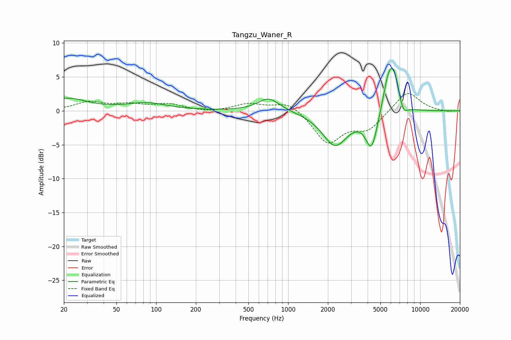

# Tangzu_Waner_R
See [usage instructions](https://github.com/jaakkopasanen/AutoEq#usage) for more options and info.

### Parametric EQs
Apply preamp of -6.4 dB when using parametric equalizer.

|   # | Type    |   Fc (Hz) |    Q |   Gain (dB) |
|-----|---------|-----------|------|-------------|
|   1 | Peaking |        21 | 0.96 |         1.8 |
|   2 | Peaking |        85 | 0.9  |         1.1 |
|   3 | Peaking |       712 | 1.71 |         2   |
|   4 | Peaking |      2269 | 1.46 |        -5   |
|   5 | Peaking |      4289 | 3.08 |        -5.4 |
|   6 | Peaking |      5727 | 3.19 |         4.3 |
|   7 | Peaking |      6212 | 3.07 |         2.3 |
|   8 | Peaking |      6415 | 3.9  |         2.3 |
|   9 | Peaking |      7484 | 4.89 |        -2.7 |
|  10 | Peaking |      7512 | 6    |         1.1 |

### Fixed Band EQs
When using fixed band (also called graphic) equalizer, apply preamp of **-2.6 dB** (if available) and set gains manually with these parameters.

|   # | Type    |   Fc (Hz) |    Q |   Gain (dB) |
|-----|---------|-----------|------|-------------|
|   1 | Peaking |        31 | 1.41 |         1.2 |
|   2 | Peaking |        62 | 1.41 |         0.8 |
|   3 | Peaking |       125 | 1.41 |         0.9 |
|   4 | Peaking |       250 | 1.41 |        -0.2 |
|   5 | Peaking |       500 | 1.41 |         1   |
|   6 | Peaking |      1000 | 1.41 |         1.5 |
|   7 | Peaking |      2000 | 1.41 |        -4.7 |
|   8 | Peaking |      4000 | 1.41 |        -2.5 |
|   9 | Peaking |      8000 | 1.41 |         3   |
|  10 | Peaking |     16000 | 1.41 |        -0.2 |

### Graphs

