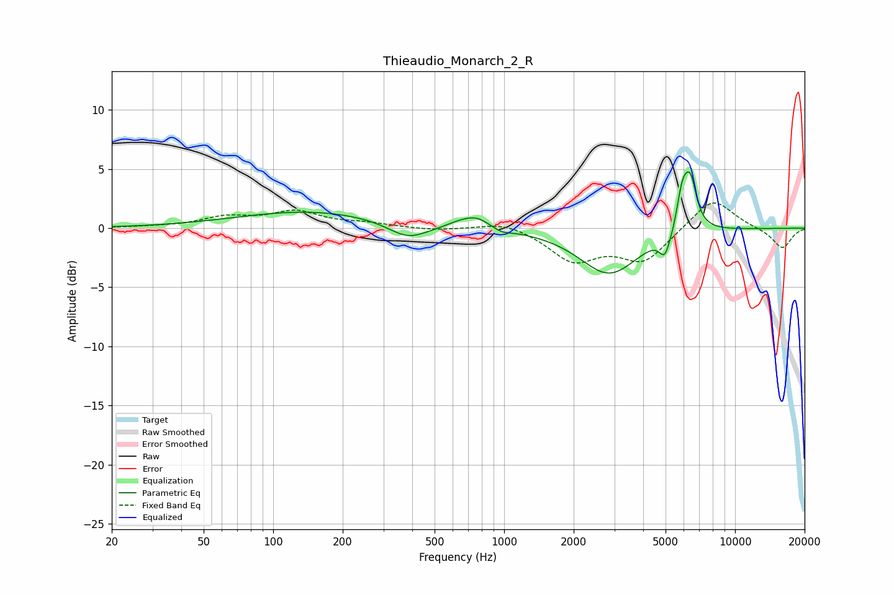

# Thieaudio_Monarch_2_R
See [usage instructions](https://github.com/jaakkopasanen/AutoEq#usage) for more options and info.

### Parametric EQs
Apply preamp of -4.9 dB when using parametric equalizer.

|   # | Type    |   Fc (Hz) |    Q |   Gain (dB) |
|-----|---------|-----------|------|-------------|
|   1 | Peaking |       145 | 0.44 |         1.4 |
|   2 | Peaking |       383 | 1.62 |        -1.4 |
|   3 | Peaking |       643 | 2.39 |         0.4 |
|   4 | Peaking |       763 | 2.56 |         0.9 |
|   5 | Peaking |       976 | 3.9  |        -0.3 |
|   6 | Peaking |      2853 | 1.1  |        -3.9 |
|   7 | Peaking |      4969 | 5.78 |        -2   |
|   8 | Peaking |      5472 | 5.99 |        -1   |
|   9 | Peaking |      5940 | 3.91 |         4.6 |
|  10 | Peaking |      6458 | 5.88 |         2.5 |

### Fixed Band EQs
When using fixed band (also called graphic) equalizer, apply preamp of **-2.2 dB** (if available) and set gains manually with these parameters.

|   # | Type    |   Fc (Hz) |    Q |   Gain (dB) |
|-----|---------|-----------|------|-------------|
|   1 | Peaking |        31 | 1.41 |         0.1 |
|   2 | Peaking |        62 | 1.41 |         0.8 |
|   3 | Peaking |       125 | 1.41 |         1.3 |
|   4 | Peaking |       250 | 1.41 |         0.3 |
|   5 | Peaking |       500 | 1.41 |        -0.2 |
|   6 | Peaking |      1000 | 1.41 |         0.6 |
|   7 | Peaking |      2000 | 1.41 |        -2.6 |
|   8 | Peaking |      4000 | 1.41 |        -2.7 |
|   9 | Peaking |      8000 | 1.41 |         2.7 |
|  10 | Peaking |     16000 | 1.41 |        -1.7 |

### Graphs

