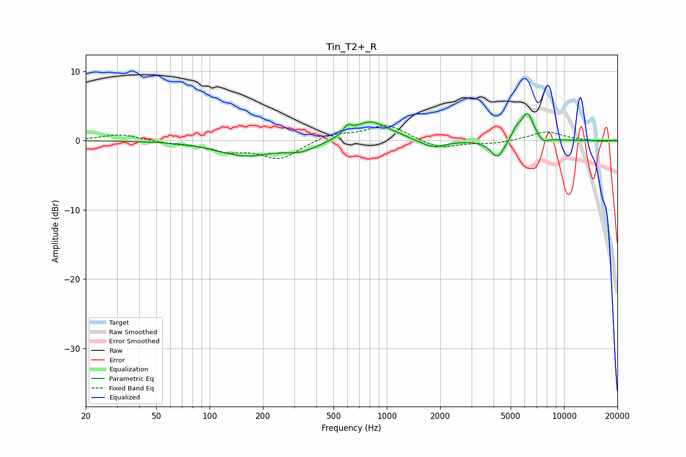

# Tin_T2+_R
See [usage instructions](https://github.com/jaakkopasanen/AutoEq#usage) for more options and info.

### Parametric EQs
Apply preamp of -4.0 dB when using parametric equalizer.

|   # | Type    |   Fc (Hz) |    Q |   Gain (dB) |
|-----|---------|-----------|------|-------------|
|   1 | Peaking |       159 | 0.92 |        -2.1 |
|   2 | Peaking |       328 | 1.51 |        -1.3 |
|   3 | Peaking |       600 | 6    |         1.2 |
|   4 | Peaking |       807 | 1.49 |         2.8 |
|   5 | Peaking |      1148 | 2.5  |         0.2 |
|   6 | Peaking |      1826 | 2.05 |        -1.2 |
|   7 | Peaking |      4217 | 3.57 |        -2.7 |
|   8 | Peaking |      5381 | 4.92 |         1.3 |
|   9 | Peaking |      6219 | 3.84 |         3.9 |
|  10 | Peaking |      7606 | 4.91 |        -0.8 |

### Fixed Band EQs
When using fixed band (also called graphic) equalizer, apply preamp of **-2.3 dB** (if available) and set gains manually with these parameters.

|   # | Type    |   Fc (Hz) |    Q |   Gain (dB) |
|-----|---------|-----------|------|-------------|
|   1 | Peaking |        31 | 1.41 |         0.9 |
|   2 | Peaking |        62 | 1.41 |        -0.4 |
|   3 | Peaking |       125 | 1.41 |        -1.3 |
|   4 | Peaking |       250 | 1.41 |        -2.6 |
|   5 | Peaking |       500 | 1.41 |         1   |
|   6 | Peaking |      1000 | 1.41 |         2.3 |
|   7 | Peaking |      2000 | 1.41 |        -1.2 |
|   8 | Peaking |      4000 | 1.41 |        -0.4 |
|   9 | Peaking |      8000 | 1.41 |         1.3 |
|  10 | Peaking |     16000 | 1.41 |        -0.2 |

### Graphs

