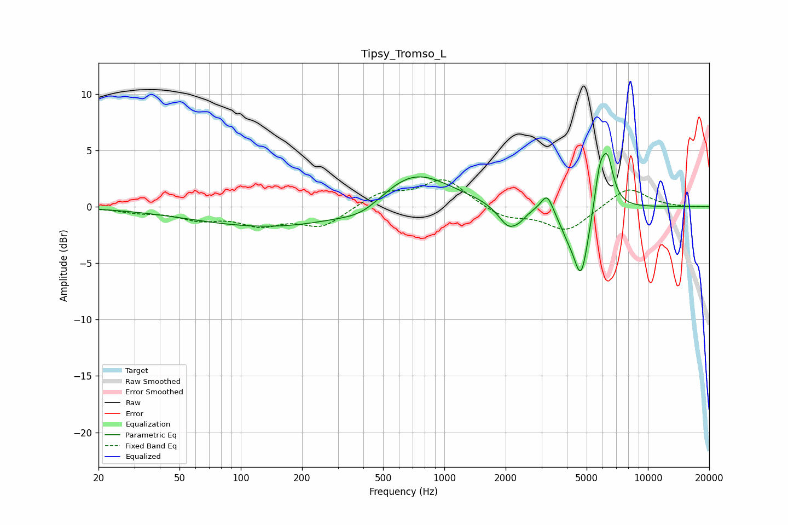

# Tipsy_Tromso_L
See [usage instructions](https://github.com/jaakkopasanen/AutoEq#usage) for more options and info.

### Parametric EQs
Apply preamp of -4.8 dB when using parametric equalizer.

|   # | Type    |   Fc (Hz) |    Q |   Gain (dB) |
|-----|---------|-----------|------|-------------|
|   1 | Peaking |       154 | 0.34 |        -1.9 |
|   2 | Peaking |       398 | 1.35 |        -1   |
|   3 | Peaking |       701 | 0.78 |         3.5 |
|   4 | Peaking |      2075 | 2.72 |        -2.1 |
|   5 | Peaking |      2362 | 4.95 |        -0.4 |
|   6 | Peaking |      3196 | 4.73 |         1.7 |
|   7 | Peaking |      4030 | 3.09 |        -1.5 |
|   8 | Peaking |      4699 | 3.81 |        -5.9 |
|   9 | Peaking |      5786 | 5.74 |         2.9 |
|  10 | Peaking |      6317 | 4.48 |         4.3 |

### Fixed Band EQs
When using fixed band (also called graphic) equalizer, apply preamp of **-2.5 dB** (if available) and set gains manually with these parameters.

|   # | Type    |   Fc (Hz) |    Q |   Gain (dB) |
|-----|---------|-----------|------|-------------|
|   1 | Peaking |        31 | 1.41 |        -0.4 |
|   2 | Peaking |        62 | 1.41 |        -1   |
|   3 | Peaking |       125 | 1.41 |        -1.4 |
|   4 | Peaking |       250 | 1.41 |        -1.7 |
|   5 | Peaking |       500 | 1.41 |         1.2 |
|   6 | Peaking |      1000 | 1.41 |         2.4 |
|   7 | Peaking |      2000 | 1.41 |        -1   |
|   8 | Peaking |      4000 | 1.41 |        -2.1 |
|   9 | Peaking |      8000 | 1.41 |         1.8 |
|  10 | Peaking |     16000 | 1.41 |        -0   |

### Graphs

