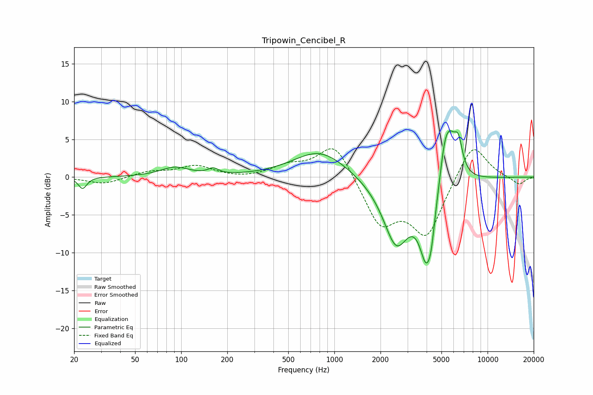

# Tripowin_Cencibel_R
See [usage instructions](https://github.com/jaakkopasanen/AutoEq#usage) for more options and info.

### Parametric EQs
Apply preamp of -6.2 dB when using parametric equalizer.

|   # | Type    |   Fc (Hz) |    Q |   Gain (dB) |
|-----|---------|-----------|------|-------------|
|   1 | Peaking |        23 | 5.3  |        -1.5 |
|   2 | Peaking |        91 | 1.5  |         1.2 |
|   3 | Peaking |       162 | 4.18 |         0.7 |
|   4 | Peaking |       807 | 0.81 |         3.6 |
|   5 | Peaking |      2535 | 1.58 |        -8.8 |
|   6 | Peaking |      3976 | 3.01 |        -8.7 |
|   7 | Peaking |      4284 | 5.98 |        -2.7 |
|   8 | Peaking |      5235 | 4.37 |         4   |
|   9 | Peaking |      5683 | 3.42 |         4.7 |
|  10 | Peaking |      6437 | 4.8  |         4   |

### Fixed Band EQs
When using fixed band (also called graphic) equalizer, apply preamp of **-3.8 dB** (if available) and set gains manually with these parameters.

|   # | Type    |   Fc (Hz) |    Q |   Gain (dB) |
|-----|---------|-----------|------|-------------|
|   1 | Peaking |        31 | 1.41 |        -0.9 |
|   2 | Peaking |        62 | 1.41 |         0.7 |
|   3 | Peaking |       125 | 1.41 |         1.4 |
|   4 | Peaking |       250 | 1.41 |        -0.2 |
|   5 | Peaking |       500 | 1.41 |         1.3 |
|   6 | Peaking |      1000 | 1.41 |         4.8 |
|   7 | Peaking |      2000 | 1.41 |        -6.1 |
|   8 | Peaking |      4000 | 1.41 |        -7.4 |
|   9 | Peaking |      8000 | 1.41 |         4.9 |
|  10 | Peaking |     16000 | 1.41 |        -1.1 |

### Graphs

