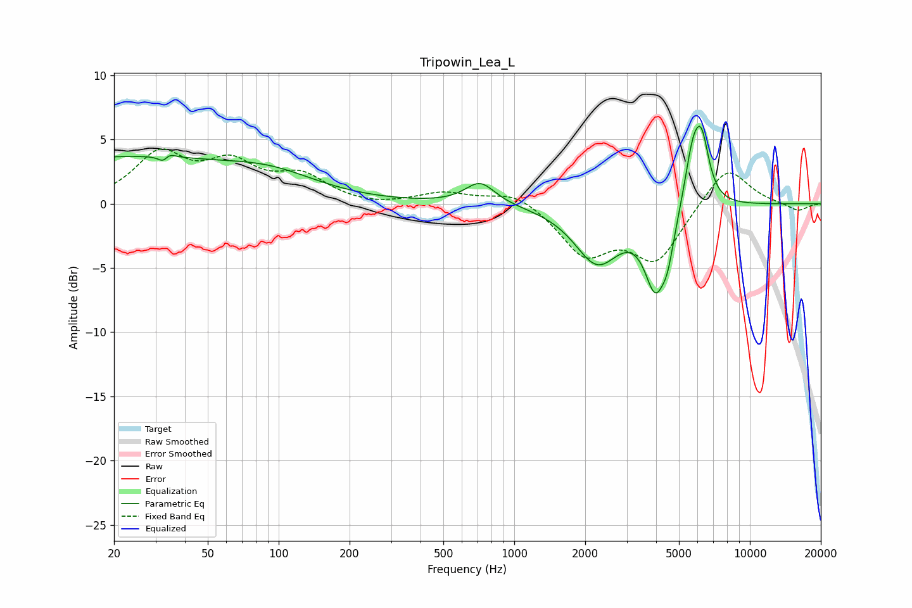

# Tripowin_Lea_L
See [usage instructions](https://github.com/jaakkopasanen/AutoEq#usage) for more options and info.

### Parametric EQs
Apply preamp of -6.1 dB when using parametric equalizer.

|   # | Type    |   Fc (Hz) |    Q |   Gain (dB) |
|-----|---------|-----------|------|-------------|
|   1 | Peaking |        20 | 0.27 |         3.5 |
|   2 | Peaking |        33 | 5.88 |        -2.9 |
|   3 | Peaking |        33 | 5.56 |         2.7 |
|   4 | Peaking |        94 | 0.7  |         1.4 |
|   5 | Peaking |       716 | 2.22 |         1.7 |
|   6 | Peaking |      2250 | 1.46 |        -4.4 |
|   7 | Peaking |      3976 | 3    |        -5.8 |
|   8 | Peaking |      4485 | 5.31 |        -2   |
|   9 | Peaking |      5710 | 4.02 |         3.9 |
|  10 | Peaking |      6244 | 4.27 |         4.5 |

### Fixed Band EQs
When using fixed band (also called graphic) equalizer, apply preamp of **-4.4 dB** (if available) and set gains manually with these parameters.

|   # | Type    |   Fc (Hz) |    Q |   Gain (dB) |
|-----|---------|-----------|------|-------------|
|   1 | Peaking |        31 | 1.41 |         3.7 |
|   2 | Peaking |        62 | 1.41 |         2.8 |
|   3 | Peaking |       125 | 1.41 |         1.9 |
|   4 | Peaking |       250 | 1.41 |        -0.3 |
|   5 | Peaking |       500 | 1.41 |         0.8 |
|   6 | Peaking |      1000 | 1.41 |         1.1 |
|   7 | Peaking |      2000 | 1.41 |        -3.8 |
|   8 | Peaking |      4000 | 1.41 |        -4.3 |
|   9 | Peaking |      8000 | 1.41 |         3.1 |
|  10 | Peaking |     16000 | 1.41 |        -0.6 |

### Graphs

