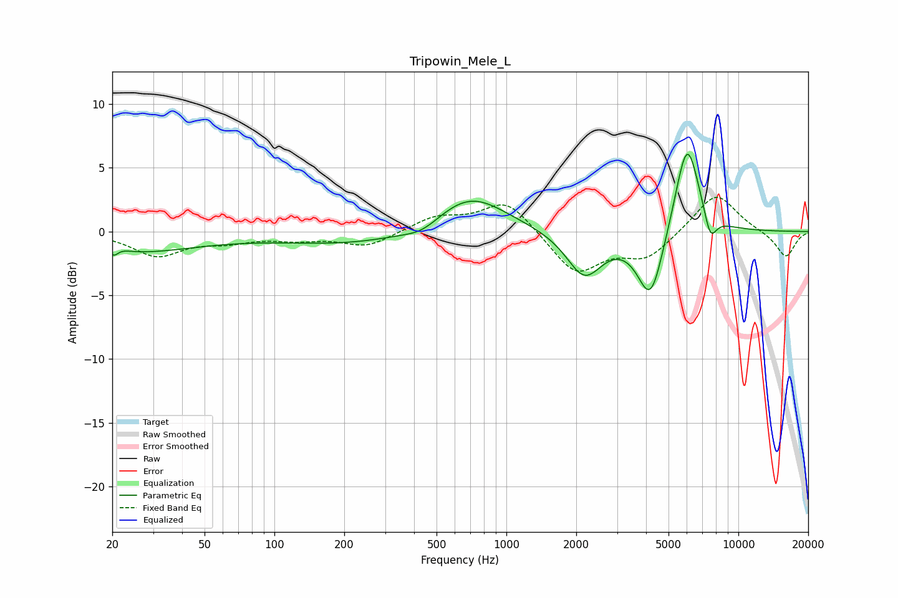

# Tripowin_Mele_L
See [usage instructions](https://github.com/jaakkopasanen/AutoEq#usage) for more options and info.

### Parametric EQs
Apply preamp of -6.1 dB when using parametric equalizer.

|   # | Type    |   Fc (Hz) |    Q |   Gain (dB) |
|-----|---------|-----------|------|-------------|
|   1 | Peaking |        20 | 3.91 |         1.3 |
|   2 | Peaking |        20 | 5.9  |        -1.5 |
|   3 | Peaking |        23 | 0.48 |        -1.6 |
|   4 | Peaking |       238 | 0.41 |        -1.1 |
|   5 | Peaking |       433 | 1.85 |        -0.7 |
|   6 | Peaking |       693 | 0.9  |         3.2 |
|   7 | Peaking |      2169 | 1.83 |        -3.5 |
|   8 | Peaking |      4187 | 2.47 |        -5.6 |
|   9 | Peaking |      6008 | 2.54 |         7.6 |
|  10 | Peaking |      7567 | 4.94 |        -2.2 |

### Fixed Band EQs
When using fixed band (also called graphic) equalizer, apply preamp of **-2.8 dB** (if available) and set gains manually with these parameters.

|   # | Type    |   Fc (Hz) |    Q |   Gain (dB) |
|-----|---------|-----------|------|-------------|
|   1 | Peaking |        31 | 1.41 |        -1.8 |
|   2 | Peaking |        62 | 1.41 |        -0.6 |
|   3 | Peaking |       125 | 1.41 |        -0.5 |
|   4 | Peaking |       250 | 1.41 |        -1.2 |
|   5 | Peaking |       500 | 1.41 |         1.1 |
|   6 | Peaking |      1000 | 1.41 |         2.5 |
|   7 | Peaking |      2000 | 1.41 |        -3.3 |
|   8 | Peaking |      4000 | 1.41 |        -2   |
|   9 | Peaking |      8000 | 1.41 |         3.1 |
|  10 | Peaking |     16000 | 1.41 |        -2   |

### Graphs

