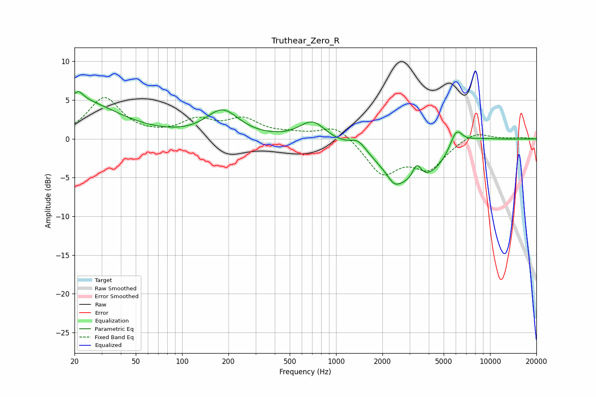

# Truthear_Zero_R
See [usage instructions](https://github.com/jaakkopasanen/AutoEq#usage) for more options and info.

### Parametric EQs
Apply preamp of -6.2 dB when using parametric equalizer.

|   # | Type    |   Fc (Hz) |    Q |   Gain (dB) |
|-----|---------|-----------|------|-------------|
|   1 | Peaking |        20 | 0.54 |         5.1 |
|   2 | Peaking |        21 | 5.02 |         1   |
|   3 | Peaking |       183 | 1.33 |         3.5 |
|   4 | Peaking |       704 | 1.68 |         2.5 |
|   5 | Peaking |      1396 | 2.66 |         1.5 |
|   6 | Peaking |      2385 | 3.29 |        -1.3 |
|   7 | Peaking |      3235 | 0.7  |        -6.1 |
|   8 | Peaking |      3345 | 4.65 |         2.3 |
|   9 | Peaking |      6034 | 3.2  |         2.8 |
|  10 | Peaking |      7594 | 0.94 |         1.3 |

### Fixed Band EQs
When using fixed band (also called graphic) equalizer, apply preamp of **-5.4 dB** (if available) and set gains manually with these parameters.

|   # | Type    |   Fc (Hz) |    Q |   Gain (dB) |
|-----|---------|-----------|------|-------------|
|   1 | Peaking |        31 | 1.41 |         5.2 |
|   2 | Peaking |        62 | 1.41 |         0.1 |
|   3 | Peaking |       125 | 1.41 |         2.1 |
|   4 | Peaking |       250 | 1.41 |         2.3 |
|   5 | Peaking |       500 | 1.41 |         0.5 |
|   6 | Peaking |      1000 | 1.41 |         1.9 |
|   7 | Peaking |      2000 | 1.41 |        -4.4 |
|   8 | Peaking |      4000 | 1.41 |        -3.6 |
|   9 | Peaking |      8000 | 1.41 |         1.1 |
|  10 | Peaking |     16000 | 1.41 |         0.1 |

### Graphs

