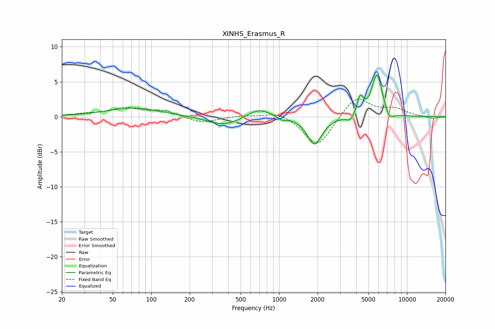

# XINHS_Erasmus_R
See [usage instructions](https://github.com/jaakkopasanen/AutoEq#usage) for more options and info.

### Parametric EQs
Apply preamp of -6.0 dB when using parametric equalizer.

|   # | Type    |   Fc (Hz) |    Q |   Gain (dB) |
|-----|---------|-----------|------|-------------|
|   1 | Peaking |        73 | 0.67 |         1.3 |
|   2 | Peaking |       373 | 1.11 |        -1.3 |
|   3 | Peaking |       693 | 1.52 |         1.4 |
|   4 | Peaking |      1049 | 4.28 |        -0.5 |
|   5 | Peaking |      1893 | 2.46 |        -4   |
|   6 | Peaking |      3597 | 4.8  |        -0.9 |
|   7 | Peaking |      4310 | 5.85 |         2.5 |
|   8 | Peaking |      5763 | 3.52 |         5.3 |
|   9 | Peaking |      6120 | 3.81 |         1   |
|  10 | Peaking |      7308 | 4.44 |        -1.3 |

### Fixed Band EQs
When using fixed band (also called graphic) equalizer, apply preamp of **-2.6 dB** (if available) and set gains manually with these parameters.

|   # | Type    |   Fc (Hz) |    Q |   Gain (dB) |
|-----|---------|-----------|------|-------------|
|   1 | Peaking |        31 | 1.41 |         0.4 |
|   2 | Peaking |        62 | 1.41 |         1.2 |
|   3 | Peaking |       125 | 1.41 |         0.8 |
|   4 | Peaking |       250 | 1.41 |        -0.9 |
|   5 | Peaking |       500 | 1.41 |         0.2 |
|   6 | Peaking |      1000 | 1.41 |         0.8 |
|   7 | Peaking |      2000 | 1.41 |        -4.4 |
|   8 | Peaking |      4000 | 1.41 |         3   |
|   9 | Peaking |      8000 | 1.41 |         1   |
|  10 | Peaking |     16000 | 1.41 |        -0.3 |

### Graphs

