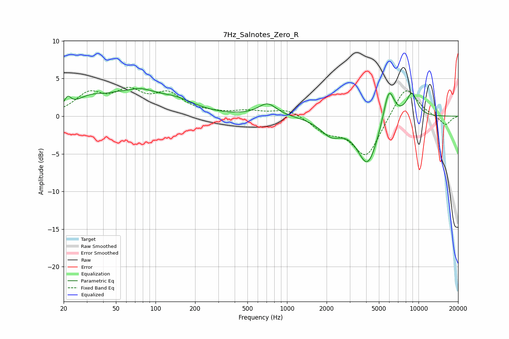

# 7Hz_Salnotes_Zero_R
See [usage instructions](https://github.com/jaakkopasanen/AutoEq#usage) for more options and info.

### Parametric EQs
Apply preamp of -3.8 dB when using parametric equalizer.

|   # | Type    |   Fc (Hz) |    Q |   Gain (dB) |
|-----|---------|-----------|------|-------------|
|   1 | Peaking |        21 | 5.7  |         1.3 |
|   2 | Peaking |        31 | 1.33 |         1.5 |
|   3 | Peaking |        62 | 1.78 |        -0.8 |
|   4 | Peaking |        66 | 0.85 |         3.7 |
|   5 | Peaking |       146 | 0.99 |         1.4 |
|   6 | Peaking |       711 | 2.05 |         1.7 |
|   7 | Peaking |      2159 | 1.74 |        -2.1 |
|   8 | Peaking |      4106 | 1.76 |        -6.4 |
|   9 | Peaking |      5949 | 3.23 |         4.8 |
|  10 | Peaking |      8889 | 2.95 |         3.2 |

### Fixed Band EQs
When using fixed band (also called graphic) equalizer, apply preamp of **-3.9 dB** (if available) and set gains manually with these parameters.

|   # | Type    |   Fc (Hz) |    Q |   Gain (dB) |
|-----|---------|-----------|------|-------------|
|   1 | Peaking |        31 | 1.41 |         2.7 |
|   2 | Peaking |        62 | 1.41 |         2.8 |
|   3 | Peaking |       125 | 1.41 |         2.6 |
|   4 | Peaking |       250 | 1.41 |         0.3 |
|   5 | Peaking |       500 | 1.41 |         0.6 |
|   6 | Peaking |      1000 | 1.41 |         1   |
|   7 | Peaking |      2000 | 1.41 |        -1.8 |
|   8 | Peaking |      4000 | 1.41 |        -5.4 |
|   9 | Peaking |      8000 | 1.41 |         4.2 |
|  10 | Peaking |     16000 | 1.41 |        -1.3 |

### Graphs

