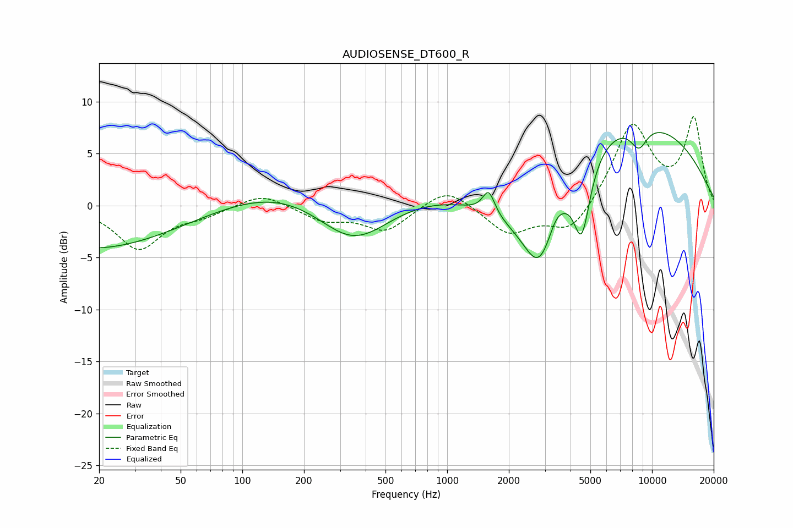

# AUDIOSENSE_DT600_R
See [usage instructions](https://github.com/jaakkopasanen/AutoEq#usage) for more options and info.

### Parametric EQs
Apply preamp of -7.1 dB when using parametric equalizer.

|   # | Type    |   Fc (Hz) |    Q |   Gain (dB) |
|-----|---------|-----------|------|-------------|
|   1 | Peaking |        42 | 0.25 |       -10.2 |
|   2 | Peaking |       125 | 0.18 |        10.1 |
|   3 | Peaking |       349 | 0.61 |        -9   |
|   4 | Peaking |      1595 | 4.78 |         2.3 |
|   5 | Peaking |      2199 | 0.68 |        -4.3 |
|   6 | Peaking |      2825 | 1.69 |        -7.2 |
|   7 | Peaking |      3385 | 4.35 |         0.8 |
|   8 | Peaking |      4539 | 3.31 |        -7.2 |
|   9 | Peaking |      7017 | 0.27 |         8.9 |
|  10 | Peaking |      8630 | 3.1  |        -2.2 |

### Fixed Band EQs
When using fixed band (also called graphic) equalizer, apply preamp of **-8.6 dB** (if available) and set gains manually with these parameters.

|   # | Type    |   Fc (Hz) |    Q |   Gain (dB) |
|-----|---------|-----------|------|-------------|
|   1 | Peaking |        31 | 1.41 |        -4.1 |
|   2 | Peaking |        62 | 1.41 |        -0.8 |
|   3 | Peaking |       125 | 1.41 |         1.3 |
|   4 | Peaking |       250 | 1.41 |        -1.3 |
|   5 | Peaking |       500 | 1.41 |        -2.4 |
|   6 | Peaking |      1000 | 1.41 |         1.9 |
|   7 | Peaking |      2000 | 1.41 |        -2.7 |
|   8 | Peaking |      4000 | 1.41 |        -2.8 |
|   9 | Peaking |      8000 | 1.41 |         7.8 |
|  10 | Peaking |     16000 | 1.41 |         8.2 |

### Graphs

