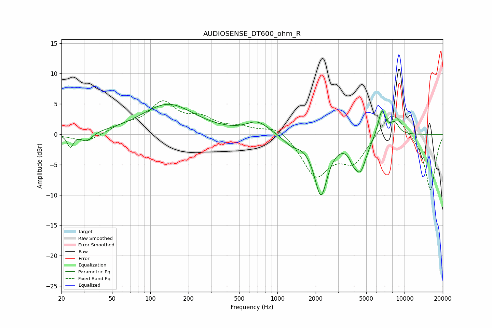

# AUDIOSENSE_DT600_ohm_R
See [usage instructions](https://github.com/jaakkopasanen/AutoEq#usage) for more options and info.

### Parametric EQs
Apply preamp of -5.0 dB when using parametric equalizer.

|   # | Type    |   Fc (Hz) |    Q |   Gain (dB) |
|-----|---------|-----------|------|-------------|
|   1 | Peaking |        23 | 5.94 |        -2.2 |
|   2 | Peaking |        32 | 3.33 |        -1.5 |
|   3 | Peaking |       138 | 0.69 |         4.9 |
|   4 | Peaking |       699 | 1.66 |         1.9 |
|   5 | Peaking |      1287 | 2.33 |        -1.3 |
|   6 | Peaking |      2198 | 2.65 |        -9.7 |
|   7 | Peaking |      3920 | 5.73 |        -1.1 |
|   8 | Peaking |      4475 | 2.77 |        -5.6 |
|   9 | Peaking |      6628 | 4.31 |         4.4 |
|  10 | Peaking |      8352 | 3.87 |         1.9 |

### Fixed Band EQs
When using fixed band (also called graphic) equalizer, apply preamp of **-5.6 dB** (if available) and set gains manually with these parameters.

|   # | Type    |   Fc (Hz) |    Q |   Gain (dB) |
|-----|---------|-----------|------|-------------|
|   1 | Peaking |        31 | 1.41 |        -1.4 |
|   2 | Peaking |        62 | 1.41 |         1.3 |
|   3 | Peaking |       125 | 1.41 |         4.9 |
|   4 | Peaking |       250 | 1.41 |         2.2 |
|   5 | Peaking |       500 | 1.41 |         1   |
|   6 | Peaking |      1000 | 1.41 |         1.6 |
|   7 | Peaking |      2000 | 1.41 |        -6.7 |
|   8 | Peaking |      4000 | 1.41 |        -4.3 |
|   9 | Peaking |      8000 | 1.41 |         4.4 |
|  10 | Peaking |     16000 | 1.41 |        -9.4 |

### Graphs

