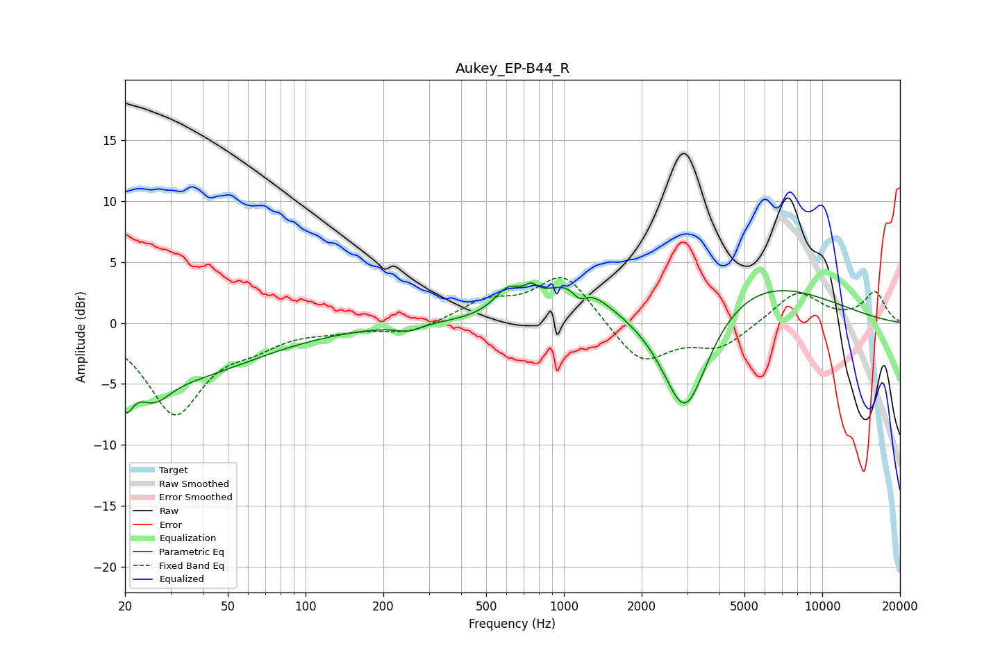

# Aukey_EP-B44_R
See [usage instructions](https://github.com/jaakkopasanen/AutoEq#usage) for more options and info.

### Parametric EQs
Apply preamp of -3.4 dB when using parametric equalizer.

|   # | Type    |   Fc (Hz) |    Q |   Gain (dB) |
|-----|---------|-----------|------|-------------|
|   1 | Peaking |        20 | 5.25 |        -2.8 |
|   2 | Peaking |        26 | 2.29 |        -2   |
|   3 | Peaking |        31 | 0.45 |        -4.3 |
|   4 | Peaking |       251 | 3.07 |        -0.5 |
|   5 | Peaking |       607 | 2.64 |         1.9 |
|   6 | Peaking |       747 | 5.77 |         0.8 |
|   7 | Peaking |      1093 | 1.23 |         3.2 |
|   8 | Peaking |      1149 | 4.97 |        -1.1 |
|   9 | Peaking |      2950 | 1.47 |       -10.1 |
|  10 | Peaking |      5002 | 0.45 |         4.1 |

### Fixed Band EQs
When using fixed band (also called graphic) equalizer, apply preamp of **-3.8 dB** (if available) and set gains manually with these parameters.

|   # | Type    |   Fc (Hz) |    Q |   Gain (dB) |
|-----|---------|-----------|------|-------------|
|   1 | Peaking |        31 | 1.41 |        -7.3 |
|   2 | Peaking |        62 | 1.41 |        -1.3 |
|   3 | Peaking |       125 | 1.41 |        -0.4 |
|   4 | Peaking |       250 | 1.41 |        -0.9 |
|   5 | Peaking |       500 | 1.41 |         1.6 |
|   6 | Peaking |      1000 | 1.41 |         4.1 |
|   7 | Peaking |      2000 | 1.41 |        -3.4 |
|   8 | Peaking |      4000 | 1.41 |        -1.9 |
|   9 | Peaking |      8000 | 1.41 |         2.6 |
|  10 | Peaking |     16000 | 1.41 |         2.5 |

### Graphs

