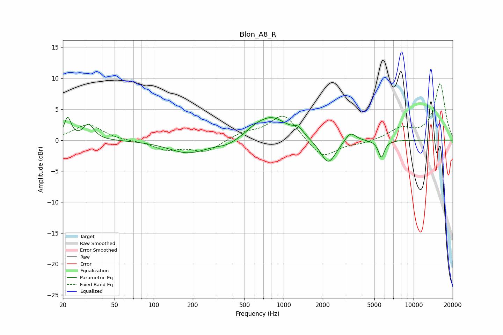

# Blon_A8_R
See [usage instructions](https://github.com/jaakkopasanen/AutoEq#usage) for more options and info.

### Parametric EQs
Apply preamp of -3.8 dB when using parametric equalizer.

|   # | Type    |   Fc (Hz) |    Q |   Gain (dB) |
|-----|---------|-----------|------|-------------|
|   1 | Peaking |        22 | 5.42 |         3.4 |
|   2 | Peaking |        32 | 3.51 |         2.4 |
|   3 | Peaking |       184 | 0.94 |        -2.1 |
|   4 | Peaking |       371 | 1.69 |        -0.8 |
|   5 | Peaking |       598 | 2.18 |         0.6 |
|   6 | Peaking |       808 | 1.15 |         3.7 |
|   7 | Peaking |      1296 | 3.93 |         1.1 |
|   8 | Peaking |      2200 | 2.37 |        -4.1 |
|   9 | Peaking |      3268 | 3.38 |         1.6 |
|  10 | Peaking |      5654 | 5.98 |        -2.8 |

### Fixed Band EQs
When using fixed band (also called graphic) equalizer, apply preamp of **-9.2 dB** (if available) and set gains manually with these parameters.

|   # | Type    |   Fc (Hz) |    Q |   Gain (dB) |
|-----|---------|-----------|------|-------------|
|   1 | Peaking |        31 | 1.41 |         2.5 |
|   2 | Peaking |        62 | 1.41 |        -0.1 |
|   3 | Peaking |       125 | 1.41 |        -1.5 |
|   4 | Peaking |       250 | 1.41 |        -1.9 |
|   5 | Peaking |       500 | 1.41 |         1.1 |
|   6 | Peaking |      1000 | 1.41 |         4.3 |
|   7 | Peaking |      2000 | 1.41 |        -3.1 |
|   8 | Peaking |      4000 | 1.41 |        -0.5 |
|   9 | Peaking |      8000 | 1.41 |         1.8 |
|  10 | Peaking |     16000 | 1.41 |         9.1 |

### Graphs

