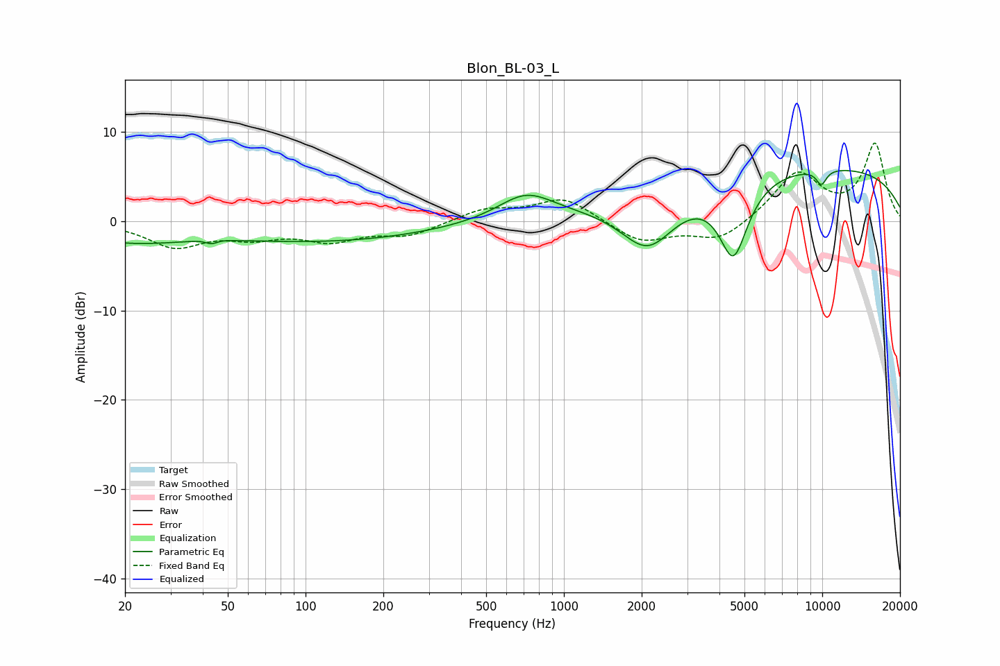

# Blon_BL-03_L
See [usage instructions](https://github.com/jaakkopasanen/AutoEq#usage) for more options and info.

### Parametric EQs
Apply preamp of -5.8 dB when using parametric equalizer.

|   # | Type    |   Fc (Hz) |    Q |   Gain (dB) |
|-----|---------|-----------|------|-------------|
|   1 | Peaking |        20 | 0.6  |        -2   |
|   2 | Peaking |        43 | 5.67 |        -0.8 |
|   3 | Peaking |        43 | 3.5  |         0.5 |
|   4 | Peaking |        50 | 1.45 |        -0   |
|   5 | Peaking |       124 | 0.35 |        -2.1 |
|   6 | Peaking |       713 | 1.3  |         3   |
|   7 | Peaking |      2117 | 1.28 |        -6.2 |
|   8 | Peaking |      4532 | 2.47 |        -8.6 |
|   9 | Peaking |      8475 | 0.18 |         6.3 |
|  10 | Peaking |      9923 | 5.96 |        -1.7 |

### Fixed Band EQs
When using fixed band (also called graphic) equalizer, apply preamp of **-8.8 dB** (if available) and set gains manually with these parameters.

|   # | Type    |   Fc (Hz) |    Q |   Gain (dB) |
|-----|---------|-----------|------|-------------|
|   1 | Peaking |        31 | 1.41 |        -2.7 |
|   2 | Peaking |        62 | 1.41 |        -1.5 |
|   3 | Peaking |       125 | 1.41 |        -1.9 |
|   4 | Peaking |       250 | 1.41 |        -1.5 |
|   5 | Peaking |       500 | 1.41 |         1.4 |
|   6 | Peaking |      1000 | 1.41 |         2.6 |
|   7 | Peaking |      2000 | 1.41 |        -2.4 |
|   8 | Peaking |      4000 | 1.41 |        -2.3 |
|   9 | Peaking |      8000 | 1.41 |         5.4 |
|  10 | Peaking |     16000 | 1.41 |         8.5 |

### Graphs

