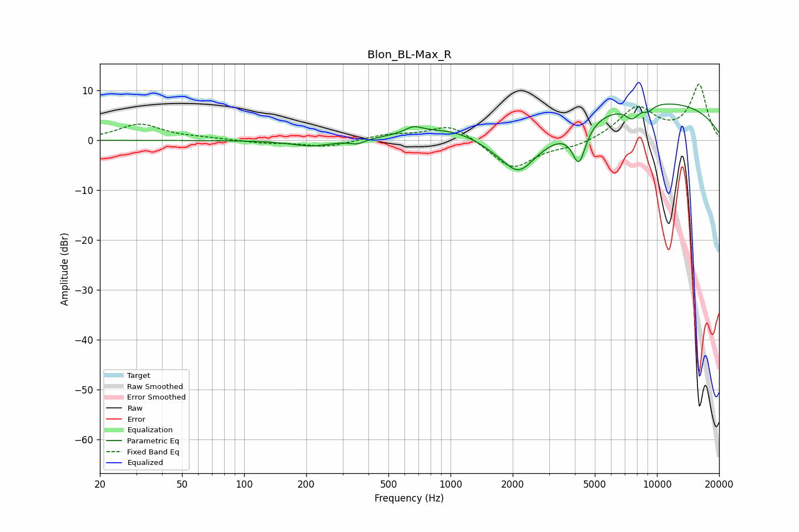

# Blon_BL-Max_R
See [usage instructions](https://github.com/jaakkopasanen/AutoEq#usage) for more options and info.

### Parametric EQs
Apply preamp of -7.4 dB when using parametric equalizer.

|   # | Type    |   Fc (Hz) |    Q |   Gain (dB) |
|-----|---------|-----------|------|-------------|
|   1 | Peaking |       213 | 1.42 |        -1.3 |
|   2 | Peaking |       353 | 3.84 |        -0.9 |
|   3 | Peaking |       662 | 3.33 |         1.3 |
|   4 | Peaking |      1085 | 0.71 |         3.7 |
|   5 | Peaking |      2073 | 0.74 |        -8.2 |
|   6 | Peaking |      2144 | 2.19 |        -3.5 |
|   7 | Peaking |      4190 | 4.13 |        -7.8 |
|   8 | Peaking |      7579 | 3.94 |        -2.5 |
|   9 | Peaking |      8527 | 0.22 |         8.2 |
|  10 | Peaking |      9075 | 4.8  |        -1.2 |

### Fixed Band EQs
When using fixed band (also called graphic) equalizer, apply preamp of **-11.3 dB** (if available) and set gains manually with these parameters.

|   # | Type    |   Fc (Hz) |    Q |   Gain (dB) |
|-----|---------|-----------|------|-------------|
|   1 | Peaking |        31 | 1.41 |         3.2 |
|   2 | Peaking |        62 | 1.41 |         0.4 |
|   3 | Peaking |       125 | 1.41 |        -0.5 |
|   4 | Peaking |       250 | 1.41 |        -1.3 |
|   5 | Peaking |       500 | 1.41 |         1.1 |
|   6 | Peaking |      1000 | 1.41 |         3.4 |
|   7 | Peaking |      2000 | 1.41 |        -5.8 |
|   8 | Peaking |      4000 | 1.41 |        -1.2 |
|   9 | Peaking |      8000 | 1.41 |         6.4 |
|  10 | Peaking |     16000 | 1.41 |        11   |

### Graphs

