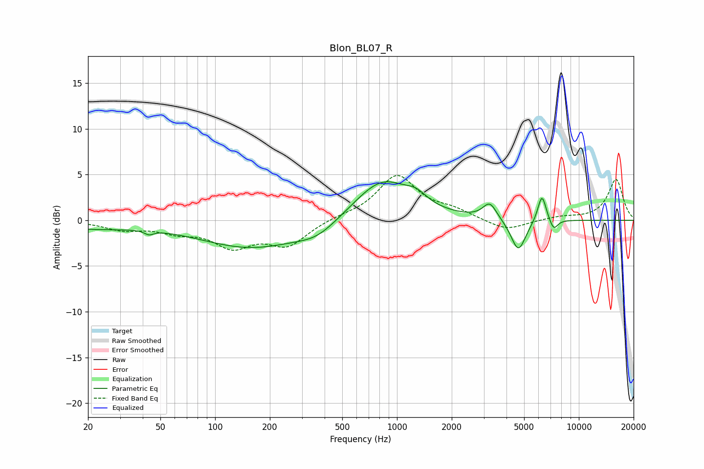

# Blon_BL07_R
See [usage instructions](https://github.com/jaakkopasanen/AutoEq#usage) for more options and info.

### Parametric EQs
Apply preamp of -4.3 dB when using parametric equalizer.

|   # | Type    |   Fc (Hz) |    Q |   Gain (dB) |
|-----|---------|-----------|------|-------------|
|   1 | Peaking |        20 | 0.63 |        -0.8 |
|   2 | Peaking |        43 | 5.96 |        -0.4 |
|   3 | Peaking |       160 | 0.49 |        -3   |
|   4 | Peaking |       364 | 1.3  |        -1.2 |
|   5 | Peaking |       831 | 0.91 |         4.6 |
|   6 | Peaking |      1278 | 2.51 |         1   |
|   7 | Peaking |      3238 | 3.75 |         1.8 |
|   8 | Peaking |      4649 | 3.43 |        -3.5 |
|   9 | Peaking |      6267 | 5.84 |         3   |
|  10 | Peaking |      7269 | 6    |        -1.2 |

### Fixed Band EQs
When using fixed band (also called graphic) equalizer, apply preamp of **-5.0 dB** (if available) and set gains manually with these parameters.

|   # | Type    |   Fc (Hz) |    Q |   Gain (dB) |
|-----|---------|-----------|------|-------------|
|   1 | Peaking |        31 | 1.41 |        -0.9 |
|   2 | Peaking |        62 | 1.41 |        -1   |
|   3 | Peaking |       125 | 1.41 |        -2.6 |
|   4 | Peaking |       250 | 1.41 |        -2.6 |
|   5 | Peaking |       500 | 1.41 |         0.3 |
|   6 | Peaking |      1000 | 1.41 |         4.8 |
|   7 | Peaking |      2000 | 1.41 |         0.9 |
|   8 | Peaking |      4000 | 1.41 |        -1.2 |
|   9 | Peaking |      8000 | 1.41 |         0.3 |
|  10 | Peaking |     16000 | 1.41 |         4.5 |

### Graphs

