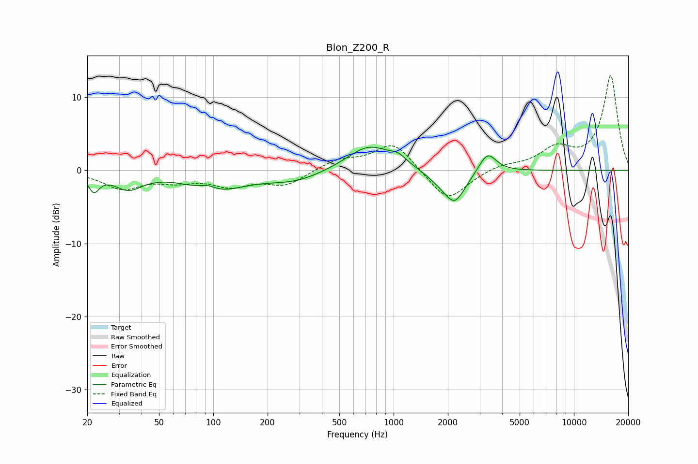

# Blon_Z200_R
See [usage instructions](https://github.com/jaakkopasanen/AutoEq#usage) for more options and info.

### Parametric EQs
Apply preamp of -3.3 dB when using parametric equalizer.

|   # | Type    |   Fc (Hz) |    Q |   Gain (dB) |
|-----|---------|-----------|------|-------------|
|   1 | Peaking |        22 | 4.81 |        -2.3 |
|   2 | Peaking |        34 | 1.8  |        -2.3 |
|   3 | Peaking |        93 | 3.09 |         0.7 |
|   4 | Peaking |       103 | 0.89 |        -2.6 |
|   5 | Peaking |       283 | 0.9  |        -1.4 |
|   6 | Peaking |       734 | 1.14 |         3.5 |
|   7 | Peaking |      1061 | 3.18 |         0.9 |
|   8 | Peaking |      1740 | 2.11 |        -0.8 |
|   9 | Peaking |      2179 | 2.29 |        -4.4 |
|  10 | Peaking |      3320 | 2.99 |         2.8 |

### Fixed Band EQs
When using fixed band (also called graphic) equalizer, apply preamp of **-13.0 dB** (if available) and set gains manually with these parameters.

|   # | Type    |   Fc (Hz) |    Q |   Gain (dB) |
|-----|---------|-----------|------|-------------|
|   1 | Peaking |        31 | 1.41 |        -2.4 |
|   2 | Peaking |        62 | 1.41 |        -1.2 |
|   3 | Peaking |       125 | 1.41 |        -1.9 |
|   4 | Peaking |       250 | 1.41 |        -1.9 |
|   5 | Peaking |       500 | 1.41 |         1.4 |
|   6 | Peaking |      1000 | 1.41 |         3.9 |
|   7 | Peaking |      2000 | 1.41 |        -4.4 |
|   8 | Peaking |      4000 | 1.41 |         0.7 |
|   9 | Peaking |      8000 | 1.41 |         2.7 |
|  10 | Peaking |     16000 | 1.41 |        12.9 |

### Graphs

