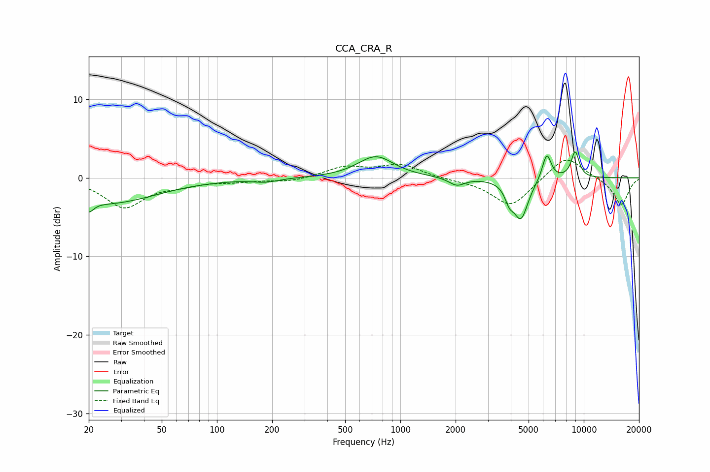

# CCA_CRA_R
See [usage instructions](https://github.com/jaakkopasanen/AutoEq#usage) for more options and info.

### Parametric EQs
Apply preamp of -3.4 dB when using parametric equalizer.

|   # | Type    |   Fc (Hz) |    Q |   Gain (dB) |
|-----|---------|-----------|------|-------------|
|   1 | Peaking |        20 | 5.5  |        -1.4 |
|   2 | Peaking |        25 | 0.54 |        -3.2 |
|   3 | Peaking |       185 | 2.07 |        -0.4 |
|   4 | Peaking |       733 | 1.45 |         2.7 |
|   5 | Peaking |       817 | 3.57 |         0   |
|   6 | Peaking |      2032 | 3.24 |        -1   |
|   7 | Peaking |      3928 | 6    |        -1.7 |
|   8 | Peaking |      4537 | 3.49 |        -5.1 |
|   9 | Peaking |      6282 | 5.61 |         3.4 |
|  10 | Peaking |      8976 | 5.76 |         3.3 |

### Fixed Band EQs
When using fixed band (also called graphic) equalizer, apply preamp of **-2.3 dB** (if available) and set gains manually with these parameters.

|   # | Type    |   Fc (Hz) |    Q |   Gain (dB) |
|-----|---------|-----------|------|-------------|
|   1 | Peaking |        31 | 1.41 |        -3.7 |
|   2 | Peaking |        62 | 1.41 |        -0.7 |
|   3 | Peaking |       125 | 1.41 |        -0.4 |
|   4 | Peaking |       250 | 1.41 |        -0.5 |
|   5 | Peaking |       500 | 1.41 |         1.3 |
|   6 | Peaking |      1000 | 1.41 |         1.6 |
|   7 | Peaking |      2000 | 1.41 |        -0.2 |
|   8 | Peaking |      4000 | 1.41 |        -3.7 |
|   9 | Peaking |      8000 | 1.41 |         2.9 |
|  10 | Peaking |     16000 | 1.41 |        -3.5 |

### Graphs

