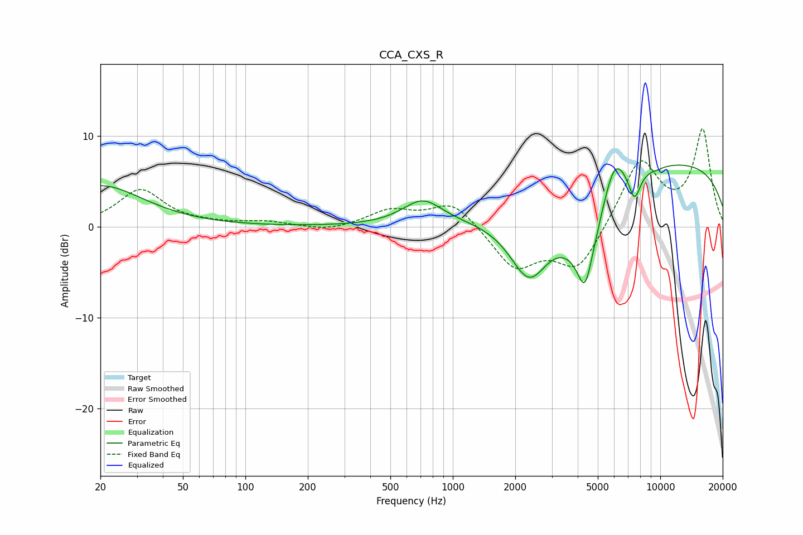

# CCA_CXS_R
See [usage instructions](https://github.com/jaakkopasanen/AutoEq#usage) for more options and info.

### Parametric EQs
Apply preamp of -6.9 dB when using parametric equalizer.

|   # | Type    |   Fc (Hz) |    Q |   Gain (dB) |
|-----|---------|-----------|------|-------------|
|   1 | Peaking |        20 | 0.69 |         4.5 |
|   2 | Peaking |       715 | 1.49 |         2.8 |
|   3 | Peaking |      2336 | 1.42 |        -7.5 |
|   4 | Peaking |      4331 | 4.36 |        -3.9 |
|   5 | Peaking |      4426 | 1.28 |        -7.8 |
|   6 | Peaking |      5147 | 5.95 |         0.1 |
|   7 | Peaking |      5985 | 2.34 |         5.2 |
|   8 | Peaking |      7509 | 4.71 |        -3.1 |
|   9 | Peaking |      9727 | 5.88 |        -0.2 |
|  10 | Peaking |     10000 | 0.2  |         7.3 |

### Fixed Band EQs
When using fixed band (also called graphic) equalizer, apply preamp of **-10.9 dB** (if available) and set gains manually with these parameters.

|   # | Type    |   Fc (Hz) |    Q |   Gain (dB) |
|-----|---------|-----------|------|-------------|
|   1 | Peaking |        31 | 1.41 |         4   |
|   2 | Peaking |        62 | 1.41 |         0.2 |
|   3 | Peaking |       125 | 1.41 |         0.5 |
|   4 | Peaking |       250 | 1.41 |        -0.5 |
|   5 | Peaking |       500 | 1.41 |         1.7 |
|   6 | Peaking |      1000 | 1.41 |         2.8 |
|   7 | Peaking |      2000 | 1.41 |        -4.5 |
|   8 | Peaking |      4000 | 1.41 |        -4.8 |
|   9 | Peaking |      8000 | 1.41 |         7.4 |
|  10 | Peaking |     16000 | 1.41 |        10.5 |

### Graphs

