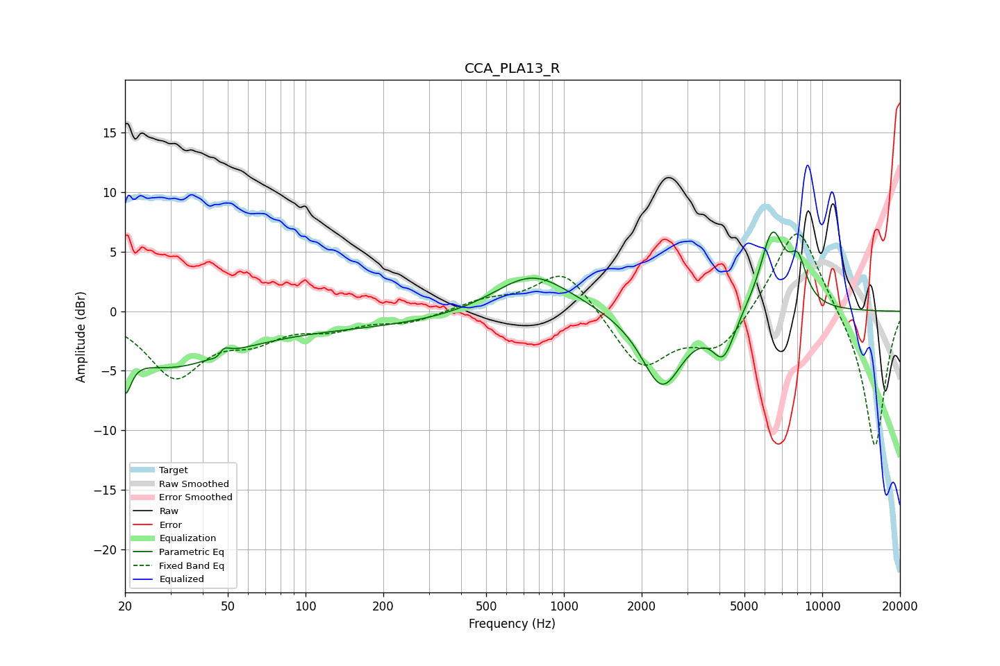

# CCA_PLA13_R
See [usage instructions](https://github.com/jaakkopasanen/AutoEq#usage) for more options and info.

### Parametric EQs
Apply preamp of -6.8 dB when using parametric equalizer.

|   # | Type    |   Fc (Hz) |    Q |   Gain (dB) |
|-----|---------|-----------|------|-------------|
|   1 | Peaking |        20 | 5.98 |        -3.3 |
|   2 | Peaking |        29 | 0.64 |        -3.9 |
|   3 | Peaking |        47 | 6    |        -3   |
|   4 | Peaking |        47 | 5.83 |         3.3 |
|   5 | Peaking |       126 | 0.24 |        -1.3 |
|   6 | Peaking |       755 | 0.94 |         3.5 |
|   7 | Peaking |      2399 | 1.75 |        -6.4 |
|   8 | Peaking |      4146 | 3.23 |        -3.5 |
|   9 | Peaking |      6409 | 2.84 |         6.7 |
|  10 | Peaking |      8054 | 3.92 |         3.2 |

### Fixed Band EQs
When using fixed band (also called graphic) equalizer, apply preamp of **-6.6 dB** (if available) and set gains manually with these parameters.

|   # | Type    |   Fc (Hz) |    Q |   Gain (dB) |
|-----|---------|-----------|------|-------------|
|   1 | Peaking |        31 | 1.41 |        -5.3 |
|   2 | Peaking |        62 | 1.41 |        -1.9 |
|   3 | Peaking |       125 | 1.41 |        -1.2 |
|   4 | Peaking |       250 | 1.41 |        -0.9 |
|   5 | Peaking |       500 | 1.41 |         0.9 |
|   6 | Peaking |      1000 | 1.41 |         3.7 |
|   7 | Peaking |      2000 | 1.41 |        -4.8 |
|   8 | Peaking |      4000 | 1.41 |        -3.2 |
|   9 | Peaking |      8000 | 1.41 |         7.8 |
|  10 | Peaking |     16000 | 1.41 |       -11.7 |

### Graphs

