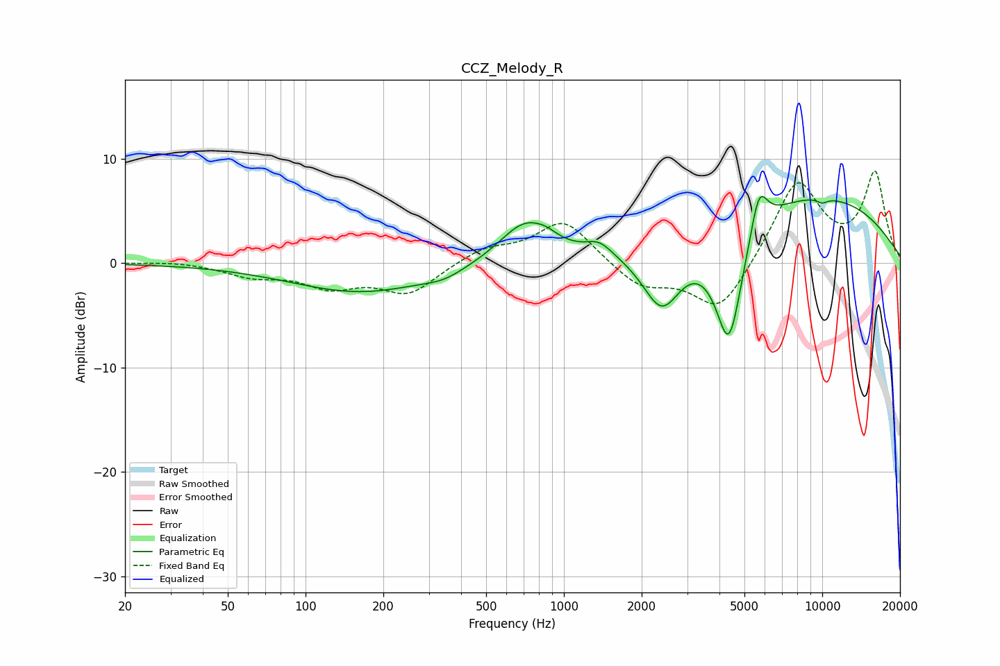

# CCZ_Melody_R
See [usage instructions](https://github.com/jaakkopasanen/AutoEq#usage) for more options and info.

### Parametric EQs
Apply preamp of -6.5 dB when using parametric equalizer.

|   # | Type    |   Fc (Hz) |    Q |   Gain (dB) |
|-----|---------|-----------|------|-------------|
|   1 | Peaking |       165 | 0.52 |        -2.8 |
|   2 | Peaking |       343 | 1.81 |        -0.7 |
|   3 | Peaking |       711 | 1.38 |         4   |
|   4 | Peaking |       857 | 3.76 |         0.4 |
|   5 | Peaking |      1369 | 2.79 |         1.2 |
|   6 | Peaking |      2395 | 1.79 |        -6.3 |
|   7 | Peaking |      4355 | 2.42 |       -12   |
|   8 | Peaking |      5687 | 4.12 |         4.4 |
|   9 | Peaking |      8282 | 0.29 |         6.8 |
|  10 | Peaking |     10000 | 6    |        -0.4 |

### Fixed Band EQs
When using fixed band (also called graphic) equalizer, apply preamp of **-8.9 dB** (if available) and set gains manually with these parameters.

|   # | Type    |   Fc (Hz) |    Q |   Gain (dB) |
|-----|---------|-----------|------|-------------|
|   1 | Peaking |        31 | 1.41 |         0.2 |
|   2 | Peaking |        62 | 1.41 |        -1.1 |
|   3 | Peaking |       125 | 1.41 |        -2   |
|   4 | Peaking |       250 | 1.41 |        -2.8 |
|   5 | Peaking |       500 | 1.41 |         1.4 |
|   6 | Peaking |      1000 | 1.41 |         4.2 |
|   7 | Peaking |      2000 | 1.41 |        -2.3 |
|   8 | Peaking |      4000 | 1.41 |        -4.9 |
|   9 | Peaking |      8000 | 1.41 |         7.9 |
|  10 | Peaking |     16000 | 1.41 |         8.5 |

### Graphs

