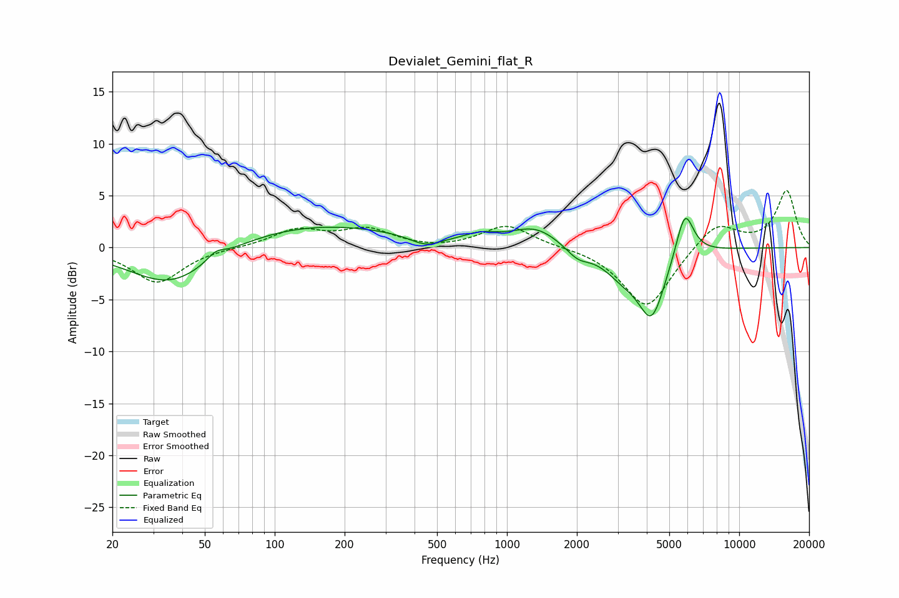

# Devialet_Gemini_flat_R
See [usage instructions](https://github.com/jaakkopasanen/AutoEq#usage) for more options and info.

### Parametric EQs
Apply preamp of -2.9 dB when using parametric equalizer.

|   # | Type    |   Fc (Hz) |    Q |   Gain (dB) |
|-----|---------|-----------|------|-------------|
|   1 | Peaking |        36 | 0.8  |        -3.9 |
|   2 | Peaking |        56 | 3.89 |         0.8 |
|   3 | Peaking |       147 | 0.37 |         2.3 |
|   4 | Peaking |       447 | 2.1  |        -1   |
|   5 | Peaking |       770 | 1.95 |         0.7 |
|   6 | Peaking |      1329 | 1.37 |         1.9 |
|   7 | Peaking |      2018 | 2.78 |        -1.1 |
|   8 | Peaking |      3154 | 1.68 |        -2.1 |
|   9 | Peaking |      4205 | 2.38 |        -6.2 |
|  10 | Peaking |      5832 | 3.63 |         4.6 |

### Fixed Band EQs
When using fixed band (also called graphic) equalizer, apply preamp of **-5.6 dB** (if available) and set gains manually with these parameters.

|   # | Type    |   Fc (Hz) |    Q |   Gain (dB) |
|-----|---------|-----------|------|-------------|
|   1 | Peaking |        31 | 1.41 |        -3.4 |
|   2 | Peaking |        62 | 1.41 |         0   |
|   3 | Peaking |       125 | 1.41 |         1.7 |
|   4 | Peaking |       250 | 1.41 |         1.6 |
|   5 | Peaking |       500 | 1.41 |        -0.2 |
|   6 | Peaking |      1000 | 1.41 |         2.2 |
|   7 | Peaking |      2000 | 1.41 |         0.1 |
|   8 | Peaking |      4000 | 1.41 |        -5.9 |
|   9 | Peaking |      8000 | 1.41 |         2.5 |
|  10 | Peaking |     16000 | 1.41 |         5.4 |

### Graphs

