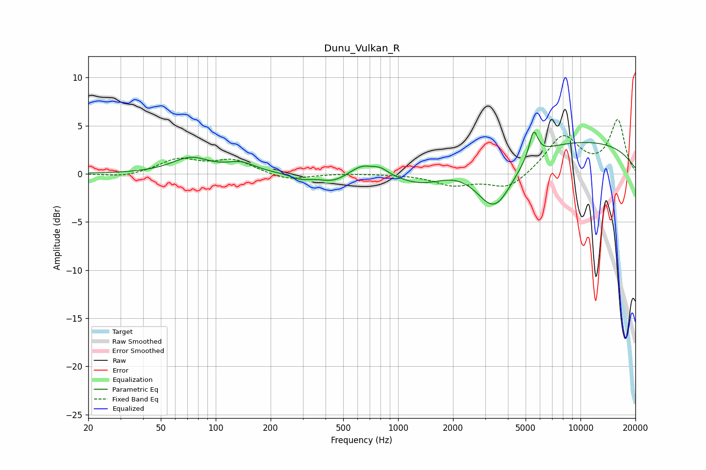

# Dunu_Vulkan_R
See [usage instructions](https://github.com/jaakkopasanen/AutoEq#usage) for more options and info.

### Parametric EQs
Apply preamp of -4.4 dB when using parametric equalizer.

|   # | Type    |   Fc (Hz) |    Q |   Gain (dB) |
|-----|---------|-----------|------|-------------|
|   1 | Peaking |        73 | 1.36 |         1.6 |
|   2 | Peaking |       138 | 1.84 |         0.9 |
|   3 | Peaking |       291 | 2.6  |        -0.5 |
|   4 | Peaking |       439 | 1.7  |        -0.9 |
|   5 | Peaking |       632 | 2.2  |         1   |
|   6 | Peaking |       799 | 3.38 |         0.6 |
|   7 | Peaking |      1357 | 0.95 |        -2.1 |
|   8 | Peaking |      3381 | 1.3  |        -6.1 |
|   9 | Peaking |      5530 | 5.76 |         2.8 |
|  10 | Peaking |      6966 | 0.18 |         3.7 |

### Fixed Band EQs
When using fixed band (also called graphic) equalizer, apply preamp of **-5.7 dB** (if available) and set gains manually with these parameters.

|   # | Type    |   Fc (Hz) |    Q |   Gain (dB) |
|-----|---------|-----------|------|-------------|
|   1 | Peaking |        31 | 1.41 |        -0.4 |
|   2 | Peaking |        62 | 1.41 |         1.5 |
|   3 | Peaking |       125 | 1.41 |         1.4 |
|   4 | Peaking |       250 | 1.41 |        -0.7 |
|   5 | Peaking |       500 | 1.41 |         0   |
|   6 | Peaking |      1000 | 1.41 |         0   |
|   7 | Peaking |      2000 | 1.41 |        -1.1 |
|   8 | Peaking |      4000 | 1.41 |        -1.6 |
|   9 | Peaking |      8000 | 1.41 |         3.9 |
|  10 | Peaking |     16000 | 1.41 |         5.5 |

### Graphs

