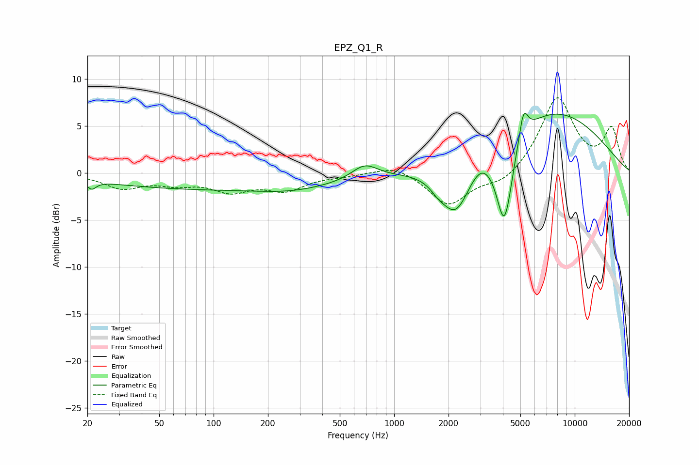

# EPZ_Q1_R
See [usage instructions](https://github.com/jaakkopasanen/AutoEq#usage) for more options and info.

### Parametric EQs
Apply preamp of -6.4 dB when using parametric equalizer.

|   # | Type    |   Fc (Hz) |    Q |   Gain (dB) |
|-----|---------|-----------|------|-------------|
|   1 | Peaking |        21 | 5.84 |        -0.9 |
|   2 | Peaking |       120 | 0.18 |        -1.8 |
|   3 | Peaking |       263 | 0.86 |        -0.4 |
|   4 | Peaking |       687 | 1.91 |         1.6 |
|   5 | Peaking |      1747 | 3.34 |        -0.7 |
|   6 | Peaking |      2192 | 1.7  |        -5.7 |
|   7 | Peaking |      3018 | 2.52 |         0.8 |
|   8 | Peaking |      4079 | 3    |        -9.3 |
|   9 | Peaking |      5202 | 5.66 |         3.2 |
|  10 | Peaking |      7197 | 0.41 |         6.8 |

### Fixed Band EQs
When using fixed band (also called graphic) equalizer, apply preamp of **-8.1 dB** (if available) and set gains manually with these parameters.

|   # | Type    |   Fc (Hz) |    Q |   Gain (dB) |
|-----|---------|-----------|------|-------------|
|   1 | Peaking |        31 | 1.41 |        -1.5 |
|   2 | Peaking |        62 | 1.41 |        -0.9 |
|   3 | Peaking |       125 | 1.41 |        -1.7 |
|   4 | Peaking |       250 | 1.41 |        -1.7 |
|   5 | Peaking |       500 | 1.41 |        -0.2 |
|   6 | Peaking |      1000 | 1.41 |         0.9 |
|   7 | Peaking |      2000 | 1.41 |        -3.5 |
|   8 | Peaking |      4000 | 1.41 |        -1.3 |
|   9 | Peaking |      8000 | 1.41 |         8   |
|  10 | Peaking |     16000 | 1.41 |         4.5 |

### Graphs

