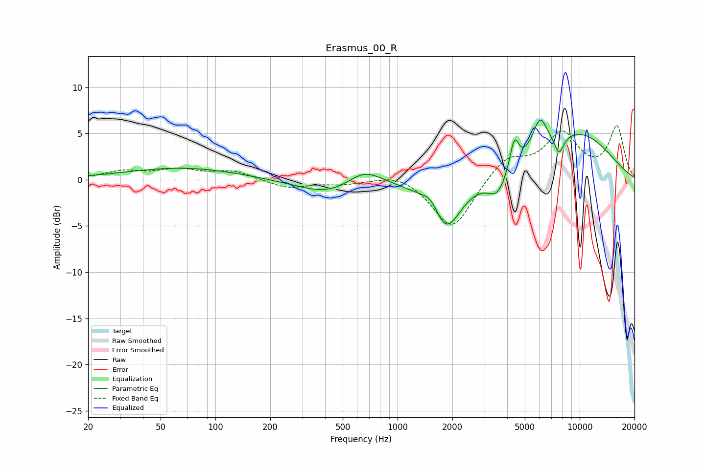

# Erasmus_00_R
See [usage instructions](https://github.com/jaakkopasanen/AutoEq#usage) for more options and info.

### Parametric EQs
Apply preamp of -6.5 dB when using parametric equalizer.

|   # | Type    |   Fc (Hz) |    Q |   Gain (dB) |
|-----|---------|-----------|------|-------------|
|   1 | Peaking |        66 | 0.46 |         1.3 |
|   2 | Peaking |       427 | 0.81 |        -1.7 |
|   3 | Peaking |       654 | 1.44 |         1.9 |
|   4 | Peaking |      1550 | 2.69 |         2.1 |
|   5 | Peaking |      1810 | 1.64 |        -6.2 |
|   6 | Peaking |      3533 | 2.72 |        -2.4 |
|   7 | Peaking |      4374 | 5.98 |         3.2 |
|   8 | Peaking |      6050 | 3.36 |         3.6 |
|   9 | Peaking |      7711 | 5.3  |        -2   |
|  10 | Peaking |      9709 | 0.56 |         4.9 |

### Fixed Band EQs
When using fixed band (also called graphic) equalizer, apply preamp of **-6.0 dB** (if available) and set gains manually with these parameters.

|   # | Type    |   Fc (Hz) |    Q |   Gain (dB) |
|-----|---------|-----------|------|-------------|
|   1 | Peaking |        31 | 1.41 |         0.8 |
|   2 | Peaking |        62 | 1.41 |         1   |
|   3 | Peaking |       125 | 1.41 |         0.9 |
|   4 | Peaking |       250 | 1.41 |        -0.9 |
|   5 | Peaking |       500 | 1.41 |        -0.4 |
|   6 | Peaking |      1000 | 1.41 |         0.9 |
|   7 | Peaking |      2000 | 1.41 |        -5.5 |
|   8 | Peaking |      4000 | 1.41 |         2.4 |
|   9 | Peaking |      8000 | 1.41 |         4.8 |
|  10 | Peaking |     16000 | 1.41 |         5.6 |

### Graphs

