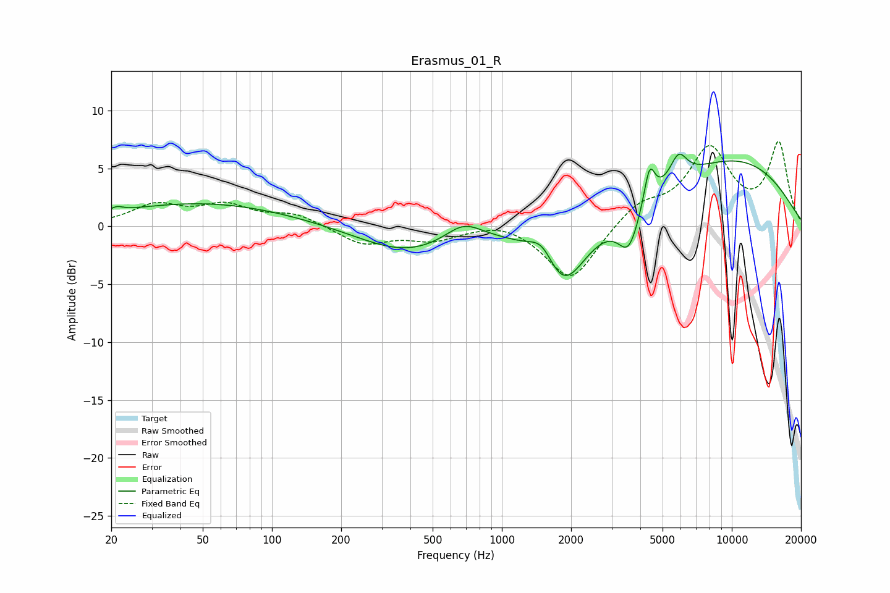

# Erasmus_01_R
See [usage instructions](https://github.com/jaakkopasanen/AutoEq#usage) for more options and info.

### Parametric EQs
Apply preamp of -6.3 dB when using parametric equalizer.

|   # | Type    |   Fc (Hz) |    Q |   Gain (dB) |
|-----|---------|-----------|------|-------------|
|   1 | Peaking |        21 | 5.33 |         0.4 |
|   2 | Peaking |        50 | 0.36 |         2   |
|   3 | Peaking |       384 | 0.67 |        -2.3 |
|   4 | Peaking |       682 | 1.75 |         1.6 |
|   5 | Peaking |      1505 | 2.46 |         2.2 |
|   6 | Peaking |      1830 | 1.4  |        -5.9 |
|   7 | Peaking |      3562 | 3.03 |        -3.5 |
|   8 | Peaking |      4389 | 5.97 |         3.2 |
|   9 | Peaking |      5863 | 3.71 |         2.3 |
|  10 | Peaking |     10000 | 0.38 |         5.7 |

### Fixed Band EQs
When using fixed band (also called graphic) equalizer, apply preamp of **-7.4 dB** (if available) and set gains manually with these parameters.

|   # | Type    |   Fc (Hz) |    Q |   Gain (dB) |
|-----|---------|-----------|------|-------------|
|   1 | Peaking |        31 | 1.41 |         1.7 |
|   2 | Peaking |        62 | 1.41 |         1.6 |
|   3 | Peaking |       125 | 1.41 |         1   |
|   4 | Peaking |       250 | 1.41 |        -1.5 |
|   5 | Peaking |       500 | 1.41 |        -1.1 |
|   6 | Peaking |      1000 | 1.41 |         0.6 |
|   7 | Peaking |      2000 | 1.41 |        -4.8 |
|   8 | Peaking |      4000 | 1.41 |         1.8 |
|   9 | Peaking |      8000 | 1.41 |         6.5 |
|  10 | Peaking |     16000 | 1.41 |         7   |

### Graphs

