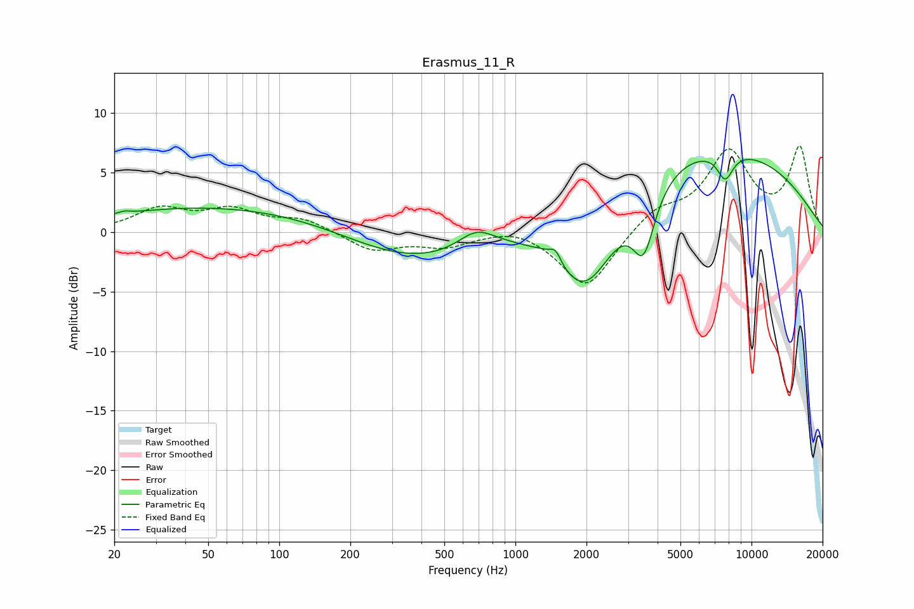

# Erasmus_11_R
See [usage instructions](https://github.com/jaakkopasanen/AutoEq#usage) for more options and info.

### Parametric EQs
Apply preamp of -6.2 dB when using parametric equalizer.

|   # | Type    |   Fc (Hz) |    Q |   Gain (dB) |
|-----|---------|-----------|------|-------------|
|   1 | Peaking |        22 | 5.98 |         0.2 |
|   2 | Peaking |        62 | 0.25 |         2.3 |
|   3 | Peaking |       370 | 0.47 |        -2.9 |
|   4 | Peaking |       683 | 1.84 |         1.6 |
|   5 | Peaking |      1325 | 3.05 |         0.4 |
|   6 | Peaking |      1478 | 5.91 |         1.1 |
|   7 | Peaking |      1983 | 0.97 |        -9   |
|   8 | Peaking |      3495 | 2.95 |        -5.2 |
|   9 | Peaking |      5607 | 0.24 |         7.8 |
|  10 | Peaking |      7737 | 3.92 |        -2.3 |

### Fixed Band EQs
When using fixed band (also called graphic) equalizer, apply preamp of **-7.3 dB** (if available) and set gains manually with these parameters.

|   # | Type    |   Fc (Hz) |    Q |   Gain (dB) |
|-----|---------|-----------|------|-------------|
|   1 | Peaking |        31 | 1.41 |         1.8 |
|   2 | Peaking |        62 | 1.41 |         1.7 |
|   3 | Peaking |       125 | 1.41 |         1   |
|   4 | Peaking |       250 | 1.41 |        -1.5 |
|   5 | Peaking |       500 | 1.41 |        -1.1 |
|   6 | Peaking |      1000 | 1.41 |         0.6 |
|   7 | Peaking |      2000 | 1.41 |        -4.8 |
|   8 | Peaking |      4000 | 1.41 |         1.8 |
|   9 | Peaking |      8000 | 1.41 |         6.5 |
|  10 | Peaking |     16000 | 1.41 |         6.9 |

### Graphs

