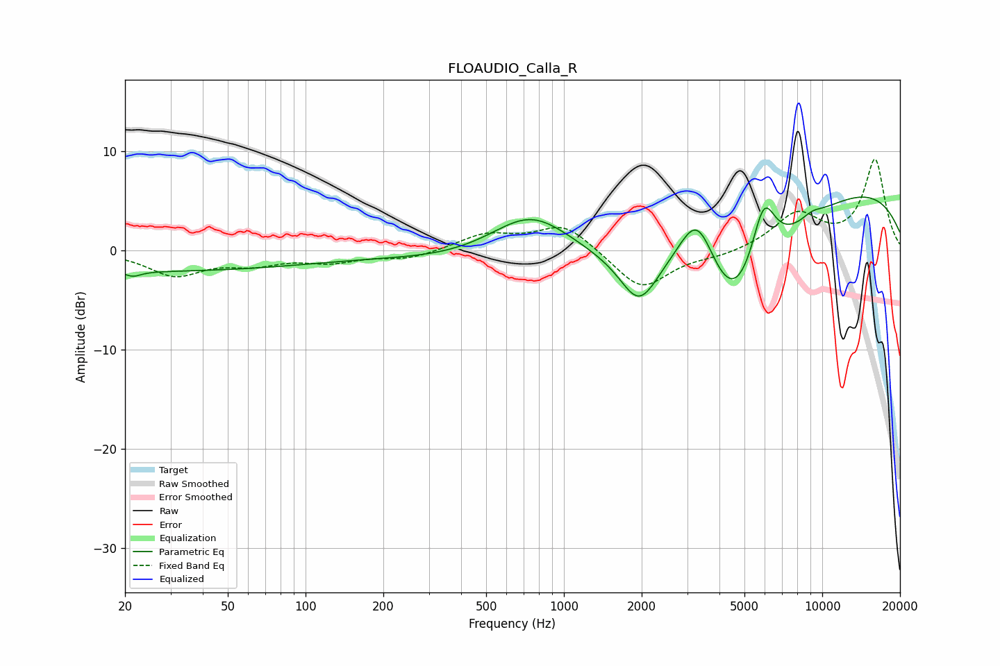

# FLOAUDIO_Calla_R
See [usage instructions](https://github.com/jaakkopasanen/AutoEq#usage) for more options and info.

### Parametric EQs
Apply preamp of -5.4 dB when using parametric equalizer.

|   # | Type    |   Fc (Hz) |    Q |   Gain (dB) |
|-----|---------|-----------|------|-------------|
|   1 | Peaking |        22 | 4.7  |        -0.5 |
|   2 | Peaking |        22 | 0.18 |        -2.1 |
|   3 | Peaking |       746 | 0.83 |         5.8 |
|   4 | Peaking |      1953 | 1.91 |        -5   |
|   5 | Peaking |      1986 | 0.18 |        -4.1 |
|   6 | Peaking |      3289 | 1.83 |         7.3 |
|   7 | Peaking |      4525 | 0.89 |       -11   |
|   8 | Peaking |      5930 | 2.8  |         6.9 |
|   9 | Peaking |      8291 | 0.18 |         7.7 |
|  10 | Peaking |      9122 | 3    |         0.6 |

### Fixed Band EQs
When using fixed band (also called graphic) equalizer, apply preamp of **-9.2 dB** (if available) and set gains manually with these parameters.

|   # | Type    |   Fc (Hz) |    Q |   Gain (dB) |
|-----|---------|-----------|------|-------------|
|   1 | Peaking |        31 | 1.41 |        -2.4 |
|   2 | Peaking |        62 | 1.41 |        -1.2 |
|   3 | Peaking |       125 | 1.41 |        -1   |
|   4 | Peaking |       250 | 1.41 |        -0.8 |
|   5 | Peaking |       500 | 1.41 |         1.6 |
|   6 | Peaking |      1000 | 1.41 |         2.7 |
|   7 | Peaking |      2000 | 1.41 |        -4   |
|   8 | Peaking |      4000 | 1.41 |        -0.5 |
|   9 | Peaking |      8000 | 1.41 |         3.5 |
|  10 | Peaking |     16000 | 1.41 |         9   |

### Graphs

