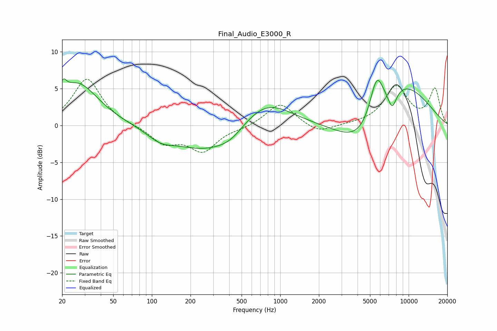

# Final_Audio_E3000_R
See [usage instructions](https://github.com/jaakkopasanen/AutoEq#usage) for more options and info.

### Parametric EQs
Apply preamp of -6.4 dB when using parametric equalizer.

|   # | Type    |   Fc (Hz) |    Q |   Gain (dB) |
|-----|---------|-----------|------|-------------|
|   1 | Peaking |        20 | 5.57 |         1.7 |
|   2 | Peaking |        26 | 0.88 |         5.7 |
|   3 | Peaking |       117 | 1.35 |        -1.3 |
|   4 | Peaking |       258 | 0.59 |        -3.3 |
|   5 | Peaking |       410 | 1.31 |        -1.3 |
|   6 | Peaking |       764 | 0.72 |         3.7 |
|   7 | Peaking |      4357 | 0.75 |        -5.5 |
|   8 | Peaking |      5627 | 2.59 |         5.3 |
|   9 | Peaking |      7445 | 3.82 |        -2.6 |
|  10 | Peaking |      8098 | 0.51 |         6.8 |

### Fixed Band EQs
When using fixed band (also called graphic) equalizer, apply preamp of **-6.4 dB** (if available) and set gains manually with these parameters.

|   # | Type    |   Fc (Hz) |    Q |   Gain (dB) |
|-----|---------|-----------|------|-------------|
|   1 | Peaking |        31 | 1.41 |         6.4 |
|   2 | Peaking |        62 | 1.41 |         0   |
|   3 | Peaking |       125 | 1.41 |        -2.3 |
|   4 | Peaking |       250 | 1.41 |        -3.3 |
|   5 | Peaking |       500 | 1.41 |        -0.3 |
|   6 | Peaking |      1000 | 1.41 |         3.1 |
|   7 | Peaking |      2000 | 1.41 |        -1.2 |
|   8 | Peaking |      4000 | 1.41 |         0.1 |
|   9 | Peaking |      8000 | 1.41 |         5.1 |
|  10 | Peaking |     16000 | 1.41 |         4.8 |

### Graphs

