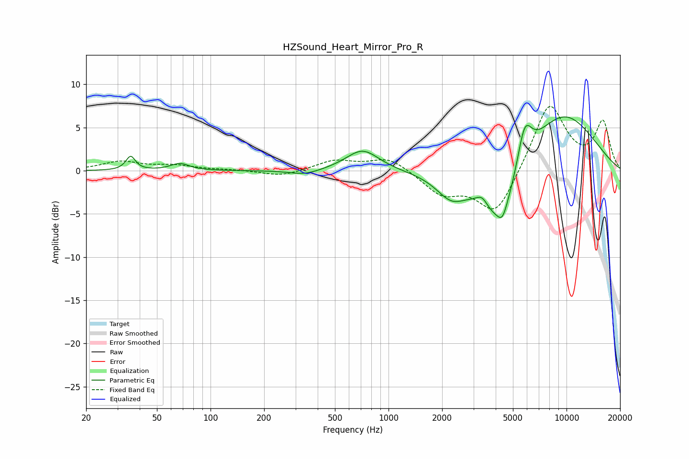

# HZSound_Heart_Mirror_Pro_R
See [usage instructions](https://github.com/jaakkopasanen/AutoEq#usage) for more options and info.

### Parametric EQs
Apply preamp of -6.3 dB when using parametric equalizer.

|   # | Type    |   Fc (Hz) |    Q |   Gain (dB) |
|-----|---------|-----------|------|-------------|
|   1 | Peaking |        36 | 5.57 |         1.6 |
|   2 | Peaking |        67 | 2.75 |         0.8 |
|   3 | Peaking |       338 | 1.66 |        -0.6 |
|   4 | Peaking |       715 | 1.52 |         2.5 |
|   5 | Peaking |      2252 | 1.66 |        -2.6 |
|   6 | Peaking |      3351 | 4.42 |         1.1 |
|   7 | Peaking |      4274 | 1.21 |        -7.8 |
|   8 | Peaking |      4366 | 5.63 |        -1.3 |
|   9 | Peaking |      5813 | 3.29 |         5   |
|  10 | Peaking |      9270 | 0.58 |         7.1 |

### Fixed Band EQs
When using fixed band (also called graphic) equalizer, apply preamp of **-7.5 dB** (if available) and set gains manually with these parameters.

|   # | Type    |   Fc (Hz) |    Q |   Gain (dB) |
|-----|---------|-----------|------|-------------|
|   1 | Peaking |        31 | 1.41 |         1   |
|   2 | Peaking |        62 | 1.41 |         0.5 |
|   3 | Peaking |       125 | 1.41 |         0.1 |
|   4 | Peaking |       250 | 1.41 |        -0.7 |
|   5 | Peaking |       500 | 1.41 |         1.2 |
|   6 | Peaking |      1000 | 1.41 |         1.6 |
|   7 | Peaking |      2000 | 1.41 |        -2.6 |
|   8 | Peaking |      4000 | 1.41 |        -5.2 |
|   9 | Peaking |      8000 | 1.41 |         8   |
|  10 | Peaking |     16000 | 1.41 |         5.5 |

### Graphs

