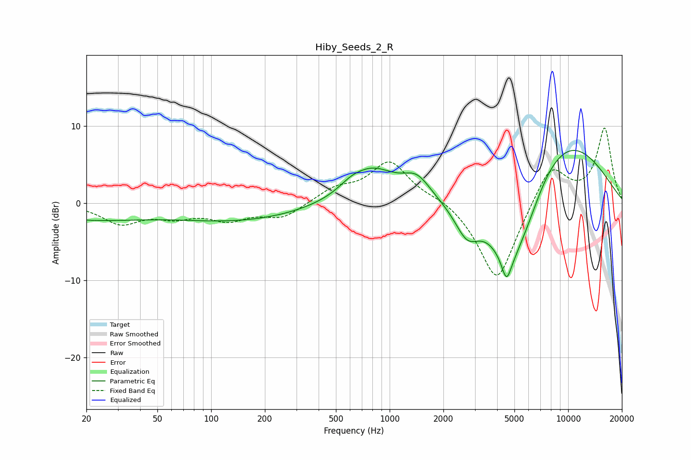

# Hiby_Seeds_2_R
See [usage instructions](https://github.com/jaakkopasanen/AutoEq#usage) for more options and info.

### Parametric EQs
Apply preamp of -6.9 dB when using parametric equalizer.

|   # | Type    |   Fc (Hz) |    Q |   Gain (dB) |
|-----|---------|-----------|------|-------------|
|   1 | Peaking |        20 | 0.43 |        -2   |
|   2 | Peaking |       146 | 0.38 |        -2.2 |
|   3 | Peaking |       602 | 2.25 |         0.7 |
|   4 | Peaking |       793 | 1.03 |         4.4 |
|   5 | Peaking |      1422 | 1.81 |         2.7 |
|   6 | Peaking |      2716 | 2.02 |        -4   |
|   7 | Peaking |      4511 | 5.7  |        -2.7 |
|   8 | Peaking |      4717 | 1.16 |       -11   |
|   9 | Peaking |      6052 | 1.76 |        -1.7 |
|  10 | Peaking |      9156 | 0.46 |         9   |

### Fixed Band EQs
When using fixed band (also called graphic) equalizer, apply preamp of **-9.8 dB** (if available) and set gains manually with these parameters.

|   # | Type    |   Fc (Hz) |    Q |   Gain (dB) |
|-----|---------|-----------|------|-------------|
|   1 | Peaking |        31 | 1.41 |        -2.5 |
|   2 | Peaking |        62 | 1.41 |        -1.5 |
|   3 | Peaking |       125 | 1.41 |        -1.9 |
|   4 | Peaking |       250 | 1.41 |        -1.9 |
|   5 | Peaking |       500 | 1.41 |         1.7 |
|   6 | Peaking |      1000 | 1.41 |         5.3 |
|   7 | Peaking |      2000 | 1.41 |         0.8 |
|   8 | Peaking |      4000 | 1.41 |       -10.5 |
|   9 | Peaking |      8000 | 1.41 |         5.3 |
|  10 | Peaking |     16000 | 1.41 |         9.6 |

### Graphs

