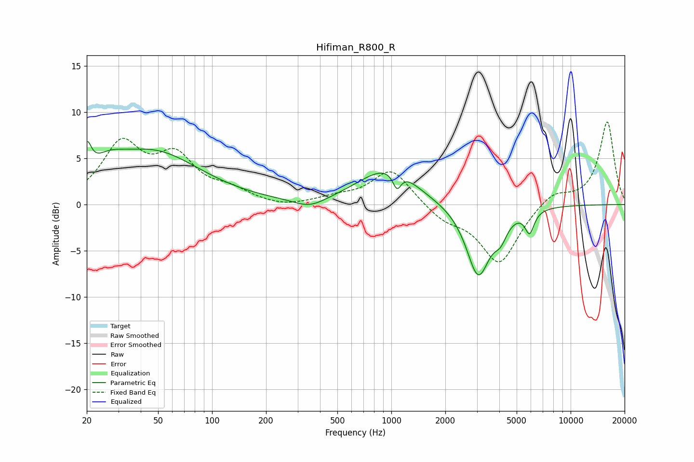

# Hifiman_R800_R
See [usage instructions](https://github.com/jaakkopasanen/AutoEq#usage) for more options and info.

### Parametric EQs
Apply preamp of -6.9 dB when using parametric equalizer.

|   # | Type    |   Fc (Hz) |    Q |   Gain (dB) |
|-----|---------|-----------|------|-------------|
|   1 | Peaking |        20 | 5.93 |         3.1 |
|   2 | Peaking |        26 | 1.54 |         1.7 |
|   3 | Peaking |        47 | 0.54 |         5.5 |
|   4 | Peaking |       351 | 1.58 |        -1   |
|   5 | Peaking |       916 | 0.89 |         3.5 |
|   6 | Peaking |      1075 | 5.96 |        -1.9 |
|   7 | Peaking |      1134 | 1.71 |         0.8 |
|   8 | Peaking |      3052 | 2.12 |        -7.7 |
|   9 | Peaking |      4068 | 3.87 |        -1.8 |
|  10 | Peaking |      5906 | 5.51 |        -2.4 |

### Fixed Band EQs
When using fixed band (also called graphic) equalizer, apply preamp of **-9.0 dB** (if available) and set gains manually with these parameters.

|   # | Type    |   Fc (Hz) |    Q |   Gain (dB) |
|-----|---------|-----------|------|-------------|
|   1 | Peaking |        31 | 1.41 |         6.2 |
|   2 | Peaking |        62 | 1.41 |         4.6 |
|   3 | Peaking |       125 | 1.41 |         1.3 |
|   4 | Peaking |       250 | 1.41 |        -0.4 |
|   5 | Peaking |       500 | 1.41 |         0.6 |
|   6 | Peaking |      1000 | 1.41 |         3.9 |
|   7 | Peaking |      2000 | 1.41 |        -1.5 |
|   8 | Peaking |      4000 | 1.41 |        -6.4 |
|   9 | Peaking |      8000 | 1.41 |         1.5 |
|  10 | Peaking |     16000 | 1.41 |         9   |

### Graphs

