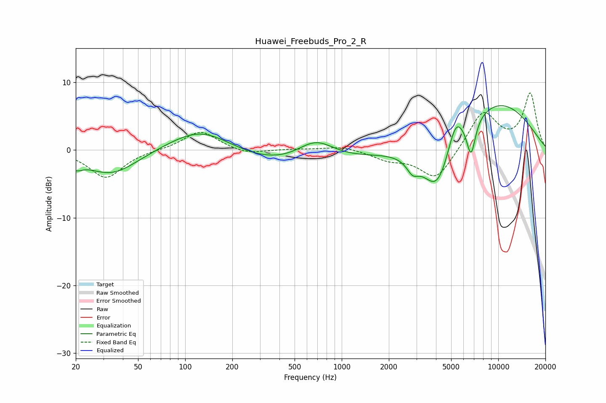

# Huawei_Freebuds_Pro_2_R
See [usage instructions](https://github.com/jaakkopasanen/AutoEq#usage) for more options and info.

### Parametric EQs
Apply preamp of -6.6 dB when using parametric equalizer.

|   # | Type    |   Fc (Hz) |    Q |   Gain (dB) |
|-----|---------|-----------|------|-------------|
|   1 | Peaking |        20 | 3.66 |        -1.2 |
|   2 | Peaking |        34 | 0.84 |        -3.7 |
|   3 | Peaking |       126 | 0.71 |         3.6 |
|   4 | Peaking |       498 | 0.37 |        -2.7 |
|   5 | Peaking |       682 | 1.14 |         3.4 |
|   6 | Peaking |      2836 | 3.72 |        -1.8 |
|   7 | Peaking |      4087 | 1.39 |        -8.5 |
|   8 | Peaking |      5334 | 2.78 |         4.1 |
|   9 | Peaking |      6701 | 4.73 |        -5.3 |
|  10 | Peaking |      9509 | 0.44 |         7.3 |

### Fixed Band EQs
When using fixed band (also called graphic) equalizer, apply preamp of **-8.5 dB** (if available) and set gains manually with these parameters.

|   # | Type    |   Fc (Hz) |    Q |   Gain (dB) |
|-----|---------|-----------|------|-------------|
|   1 | Peaking |        31 | 1.41 |        -4.1 |
|   2 | Peaking |        62 | 1.41 |         0   |
|   3 | Peaking |       125 | 1.41 |         2.9 |
|   4 | Peaking |       250 | 1.41 |        -0.7 |
|   5 | Peaking |       500 | 1.41 |         0.1 |
|   6 | Peaking |      1000 | 1.41 |         0.6 |
|   7 | Peaking |      2000 | 1.41 |        -1.3 |
|   8 | Peaking |      4000 | 1.41 |        -4.5 |
|   9 | Peaking |      8000 | 1.41 |         5.7 |
|  10 | Peaking |     16000 | 1.41 |         8.2 |

### Graphs

