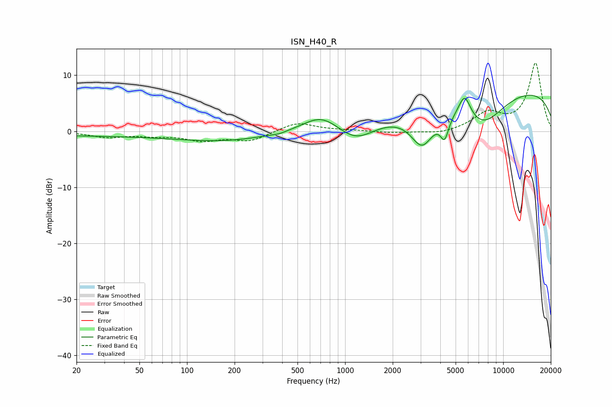

# ISN_H40_R
See [usage instructions](https://github.com/jaakkopasanen/AutoEq#usage) for more options and info.

### Parametric EQs
Apply preamp of -6.5 dB when using parametric equalizer.

|   # | Type    |   Fc (Hz) |    Q |   Gain (dB) |
|-----|---------|-----------|------|-------------|
|   1 | Peaking |        36 | 0.18 |        -0.8 |
|   2 | Peaking |       185 | 0.49 |        -1.3 |
|   3 | Peaking |       383 | 3.52 |        -0.2 |
|   4 | Peaking |       707 | 1.22 |         3   |
|   5 | Peaking |      1169 | 1.21 |        -3.2 |
|   6 | Peaking |      3070 | 1.9  |        -6.4 |
|   7 | Peaking |      4262 | 5.29 |        -3.8 |
|   8 | Peaking |      5702 | 3.63 |         4.2 |
|   9 | Peaking |      7402 | 0.93 |        -6   |
|  10 | Peaking |     10000 | 0.18 |         7.9 |

### Fixed Band EQs
When using fixed band (also called graphic) equalizer, apply preamp of **-12.3 dB** (if available) and set gains manually with these parameters.

|   # | Type    |   Fc (Hz) |    Q |   Gain (dB) |
|-----|---------|-----------|------|-------------|
|   1 | Peaking |        31 | 1.41 |        -1   |
|   2 | Peaking |        62 | 1.41 |        -0.6 |
|   3 | Peaking |       125 | 1.41 |        -1.5 |
|   4 | Peaking |       250 | 1.41 |        -1.7 |
|   5 | Peaking |       500 | 1.41 |         1.6 |
|   6 | Peaking |      1000 | 1.41 |         0.1 |
|   7 | Peaking |      2000 | 1.41 |        -0.3 |
|   8 | Peaking |      4000 | 1.41 |        -0.6 |
|   9 | Peaking |      8000 | 1.41 |         3   |
|  10 | Peaking |     16000 | 1.41 |        12.1 |

### Graphs

