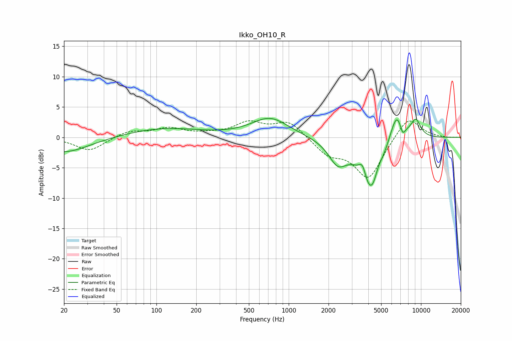

# Ikko_OH10_R
See [usage instructions](https://github.com/jaakkopasanen/AutoEq#usage) for more options and info.

### Parametric EQs
Apply preamp of -3.2 dB when using parametric equalizer.

|   # | Type    |   Fc (Hz) |    Q |   Gain (dB) |
|-----|---------|-----------|------|-------------|
|   1 | Peaking |        20 | 0.74 |        -2.6 |
|   2 | Peaking |       113 | 0.49 |         1.5 |
|   3 | Peaking |       723 | 1.01 |         3.2 |
|   4 | Peaking |      2348 | 2.04 |        -3.6 |
|   5 | Peaking |      3616 | 5.19 |         2.4 |
|   6 | Peaking |      4204 | 1.76 |        -9.4 |
|   7 | Peaking |      4746 | 5.06 |         1.4 |
|   8 | Peaking |      6579 | 2.49 |         5.6 |
|   9 | Peaking |      7259 | 5.93 |        -2.2 |
|  10 | Peaking |      9145 | 3.4  |         2.8 |

### Fixed Band EQs
When using fixed band (also called graphic) equalizer, apply preamp of **-2.8 dB** (if available) and set gains manually with these parameters.

|   # | Type    |   Fc (Hz) |    Q |   Gain (dB) |
|-----|---------|-----------|------|-------------|
|   1 | Peaking |        31 | 1.41 |        -2.3 |
|   2 | Peaking |        62 | 1.41 |         1   |
|   3 | Peaking |       125 | 1.41 |         1.4 |
|   4 | Peaking |       250 | 1.41 |         0.4 |
|   5 | Peaking |       500 | 1.41 |         2.3 |
|   6 | Peaking |      1000 | 1.41 |         2.6 |
|   7 | Peaking |      2000 | 1.41 |        -2.6 |
|   8 | Peaking |      4000 | 1.41 |        -6.7 |
|   9 | Peaking |      8000 | 1.41 |         3.7 |
|  10 | Peaking |     16000 | 1.41 |        -0.1 |

### Graphs

