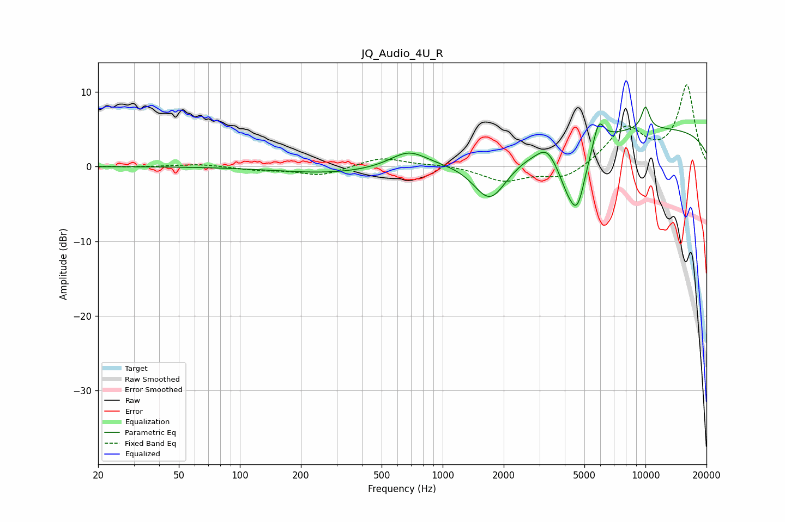

# JQ_Audio_4U_R
See [usage instructions](https://github.com/jaakkopasanen/AutoEq#usage) for more options and info.

### Parametric EQs
Apply preamp of -8.1 dB when using parametric equalizer.

|   # | Type    |   Fc (Hz) |    Q |   Gain (dB) |
|-----|---------|-----------|------|-------------|
|   1 | Peaking |       288 | 0.54 |        -0.9 |
|   2 | Peaking |       679 | 1.54 |         2.3 |
|   3 | Peaking |      1281 | 1.56 |         0.2 |
|   4 | Peaking |      1713 | 1.62 |        -6.1 |
|   5 | Peaking |      3252 | 3.4  |         1.4 |
|   6 | Peaking |      4119 | 2.76 |        -3.7 |
|   7 | Peaking |      4628 | 3.19 |        -7.2 |
|   8 | Peaking |      5885 | 4.99 |         3.4 |
|   9 | Peaking |     10000 | 0.18 |         5.2 |
|  10 | Peaking |     10000 | 6    |         3   |

### Fixed Band EQs
When using fixed band (also called graphic) equalizer, apply preamp of **-11.0 dB** (if available) and set gains manually with these parameters.

|   # | Type    |   Fc (Hz) |    Q |   Gain (dB) |
|-----|---------|-----------|------|-------------|
|   1 | Peaking |        31 | 1.41 |        -0   |
|   2 | Peaking |        62 | 1.41 |         0.3 |
|   3 | Peaking |       125 | 1.41 |        -0.4 |
|   4 | Peaking |       250 | 1.41 |        -1.2 |
|   5 | Peaking |       500 | 1.41 |         1.3 |
|   6 | Peaking |      1000 | 1.41 |         0.2 |
|   7 | Peaking |      2000 | 1.41 |        -1.9 |
|   8 | Peaking |      4000 | 1.41 |        -1.8 |
|   9 | Peaking |      8000 | 1.41 |         5.1 |
|  10 | Peaking |     16000 | 1.41 |        10.8 |

### Graphs

