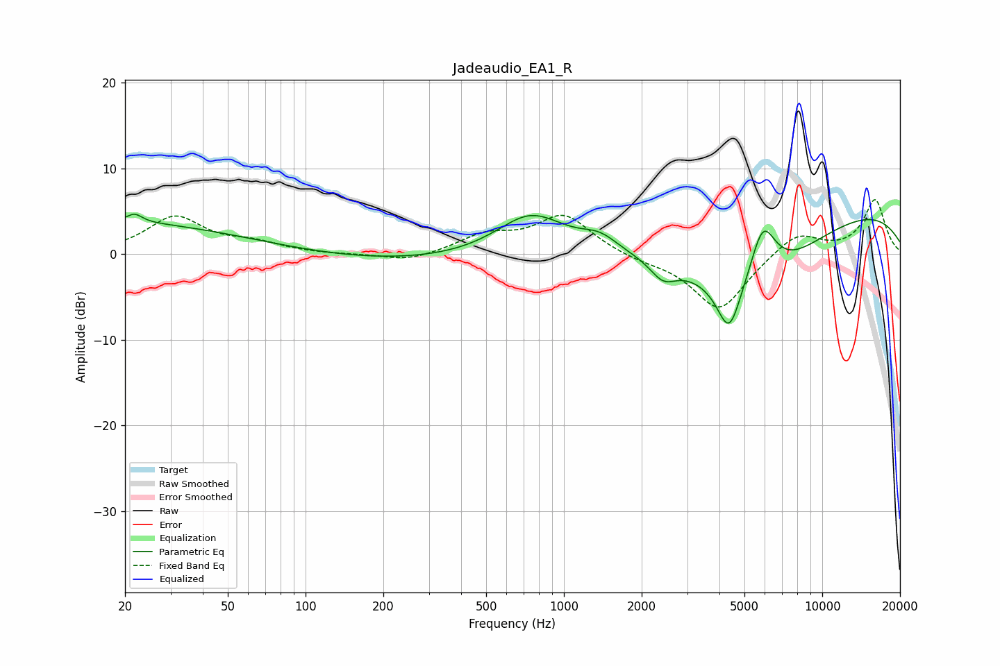

# Jadeaudio_EA1_R
See [usage instructions](https://github.com/jaakkopasanen/AutoEq#usage) for more options and info.

### Parametric EQs
Apply preamp of -4.7 dB when using parametric equalizer.

|   # | Type    |   Fc (Hz) |    Q |   Gain (dB) |
|-----|---------|-----------|------|-------------|
|   1 | Peaking |        20 | 0.24 |         4.2 |
|   2 | Peaking |        22 | 5.05 |         0.9 |
|   3 | Peaking |       133 | 0.21 |        -1.3 |
|   4 | Peaking |       744 | 1.05 |         4.9 |
|   5 | Peaking |      1374 | 1.97 |         1.6 |
|   6 | Peaking |      2422 | 2.81 |        -2.2 |
|   7 | Peaking |      4359 | 3.11 |        -5.9 |
|   8 | Peaking |      5336 | 0.61 |        -9.6 |
|   9 | Peaking |      5886 | 2.55 |         7.5 |
|  10 | Peaking |     10000 | 0.23 |         6.1 |

### Fixed Band EQs
When using fixed band (also called graphic) equalizer, apply preamp of **-6.4 dB** (if available) and set gains manually with these parameters.

|   # | Type    |   Fc (Hz) |    Q |   Gain (dB) |
|-----|---------|-----------|------|-------------|
|   1 | Peaking |        31 | 1.41 |         4.2 |
|   2 | Peaking |        62 | 1.41 |         1.1 |
|   3 | Peaking |       125 | 1.41 |        -0.1 |
|   4 | Peaking |       250 | 1.41 |        -0.9 |
|   5 | Peaking |       500 | 1.41 |         2   |
|   6 | Peaking |      1000 | 1.41 |         4.5 |
|   7 | Peaking |      2000 | 1.41 |        -0.6 |
|   8 | Peaking |      4000 | 1.41 |        -6.7 |
|   9 | Peaking |      8000 | 1.41 |         2.6 |
|  10 | Peaking |     16000 | 1.41 |         6.3 |

### Graphs

