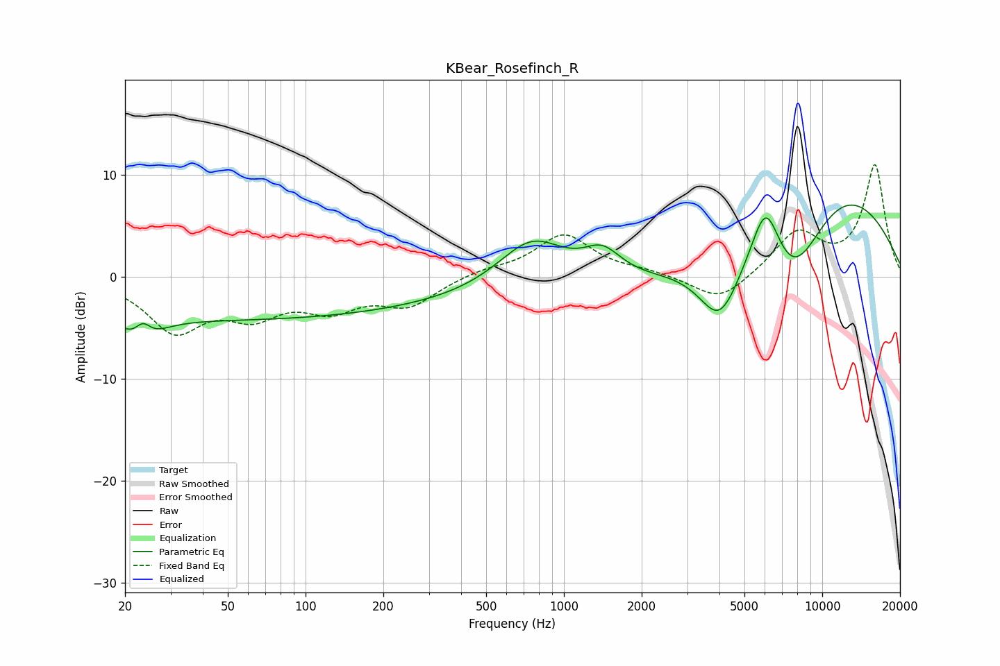

# KBear_Rosefinch_R
See [usage instructions](https://github.com/jaakkopasanen/AutoEq#usage) for more options and info.

### Parametric EQs
Apply preamp of -7.1 dB when using parametric equalizer.

|   # | Type    |   Fc (Hz) |    Q |   Gain (dB) |
|-----|---------|-----------|------|-------------|
|   1 | Peaking |        23 | 2.47 |        -4.7 |
|   2 | Peaking |        23 | 3.76 |         3.9 |
|   3 | Peaking |        45 | 0.18 |        -4.1 |
|   4 | Peaking |       751 | 1.04 |         5.2 |
|   5 | Peaking |       874 | 0.25 |        -2   |
|   6 | Peaking |      1408 | 1.9  |         2.7 |
|   7 | Peaking |      4008 | 1.7  |        -6.3 |
|   8 | Peaking |      6044 | 2.34 |         6.8 |
|   9 | Peaking |      7698 | 0.9  |       -10   |
|  10 | Peaking |     10000 | 0.38 |        11.6 |

### Fixed Band EQs
When using fixed band (also called graphic) equalizer, apply preamp of **-11.1 dB** (if available) and set gains manually with these parameters.

|   # | Type    |   Fc (Hz) |    Q |   Gain (dB) |
|-----|---------|-----------|------|-------------|
|   1 | Peaking |        31 | 1.41 |        -5   |
|   2 | Peaking |        62 | 1.41 |        -3.2 |
|   3 | Peaking |       125 | 1.41 |        -2.7 |
|   4 | Peaking |       250 | 1.41 |        -2.6 |
|   5 | Peaking |       500 | 1.41 |         0.6 |
|   6 | Peaking |      1000 | 1.41 |         4.1 |
|   7 | Peaking |      2000 | 1.41 |         0.4 |
|   8 | Peaking |      4000 | 1.41 |        -2.6 |
|   9 | Peaking |      8000 | 1.41 |         4.2 |
|  10 | Peaking |     16000 | 1.41 |        10.9 |

### Graphs

