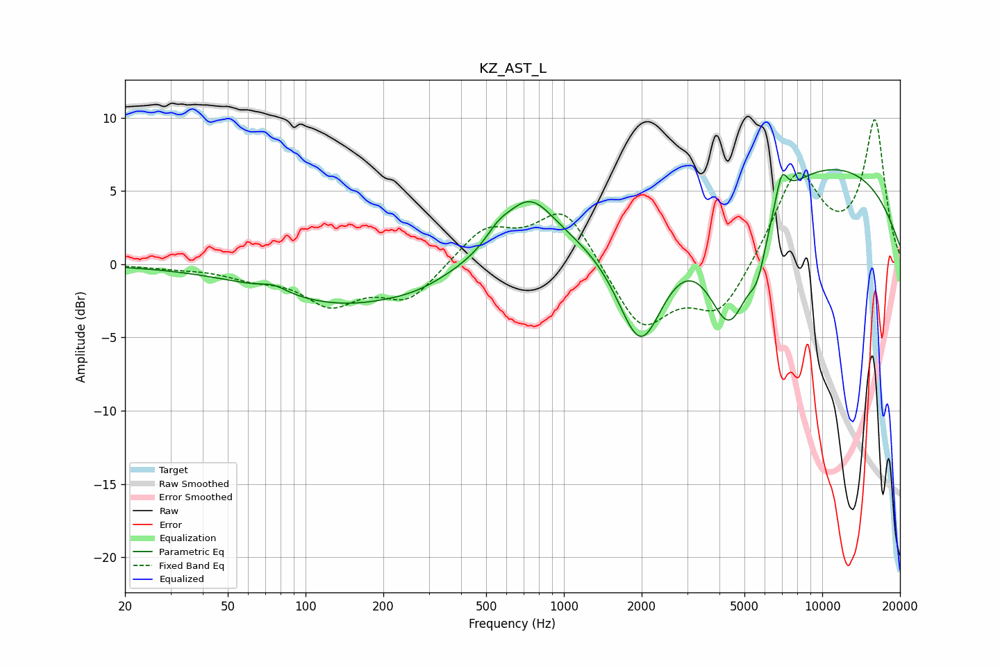

# KZ_AST_L
See [usage instructions](https://github.com/jaakkopasanen/AutoEq#usage) for more options and info.

### Parametric EQs
Apply preamp of -6.5 dB when using parametric equalizer.

|   # | Type    |   Fc (Hz) |    Q |   Gain (dB) |
|-----|---------|-----------|------|-------------|
|   1 | Peaking |        75 | 2.78 |         0.5 |
|   2 | Peaking |       143 | 0.47 |        -2.7 |
|   3 | Peaking |       273 | 1.26 |        -0.4 |
|   4 | Peaking |       555 | 2.94 |         0.8 |
|   5 | Peaking |       732 | 1.43 |         3.7 |
|   6 | Peaking |      1985 | 1.37 |        -9.3 |
|   7 | Peaking |      4388 | 1.45 |        -9.5 |
|   8 | Peaking |      5619 | 3.87 |        -2.5 |
|   9 | Peaking |      6750 | 0.18 |         7.7 |
|  10 | Peaking |      6957 | 5.88 |         2.2 |

### Fixed Band EQs
When using fixed band (also called graphic) equalizer, apply preamp of **-9.9 dB** (if available) and set gains manually with these parameters.

|   # | Type    |   Fc (Hz) |    Q |   Gain (dB) |
|-----|---------|-----------|------|-------------|
|   1 | Peaking |        31 | 1.41 |        -0.2 |
|   2 | Peaking |        62 | 1.41 |        -0.7 |
|   3 | Peaking |       125 | 1.41 |        -2.5 |
|   4 | Peaking |       250 | 1.41 |        -2.4 |
|   5 | Peaking |       500 | 1.41 |         2.4 |
|   6 | Peaking |      1000 | 1.41 |         3.9 |
|   7 | Peaking |      2000 | 1.41 |        -4.4 |
|   8 | Peaking |      4000 | 1.41 |        -3.4 |
|   9 | Peaking |      8000 | 1.41 |         6.2 |
|  10 | Peaking |     16000 | 1.41 |         9.6 |

### Graphs

