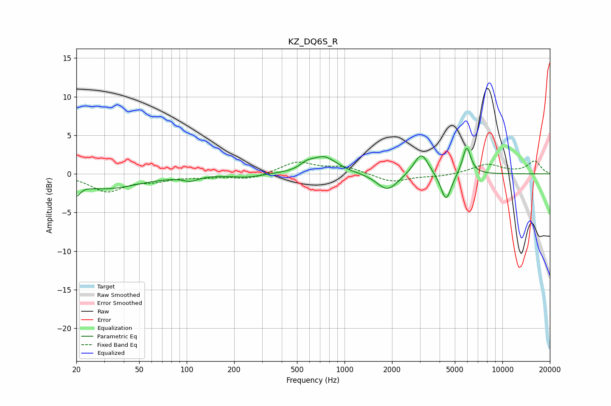

# KZ_DQ6S_R
See [usage instructions](https://github.com/jaakkopasanen/AutoEq#usage) for more options and info.

### Parametric EQs
Apply preamp of -3.4 dB when using parametric equalizer.

|   # | Type    |   Fc (Hz) |    Q |   Gain (dB) |
|-----|---------|-----------|------|-------------|
|   1 | Peaking |        20 | 5.96 |        -1.5 |
|   2 | Peaking |        31 | 0.66 |        -1.9 |
|   3 | Peaking |       106 | 3.04 |        -0.6 |
|   4 | Peaking |       241 | 1.55 |        -0.4 |
|   5 | Peaking |       575 | 3.73 |         0.6 |
|   6 | Peaking |       739 | 1.72 |         2.2 |
|   7 | Peaking |      1871 | 2.15 |        -2.2 |
|   8 | Peaking |      3062 | 3.13 |         2.9 |
|   9 | Peaking |      4393 | 4.24 |        -3.7 |
|  10 | Peaking |      5940 | 5.25 |         3.6 |

### Fixed Band EQs
When using fixed band (also called graphic) equalizer, apply preamp of **-1.8 dB** (if available) and set gains manually with these parameters.

|   # | Type    |   Fc (Hz) |    Q |   Gain (dB) |
|-----|---------|-----------|------|-------------|
|   1 | Peaking |        31 | 1.41 |        -2.2 |
|   2 | Peaking |        62 | 1.41 |        -0.7 |
|   3 | Peaking |       125 | 1.41 |        -0.3 |
|   4 | Peaking |       250 | 1.41 |        -0.7 |
|   5 | Peaking |       500 | 1.41 |         1.5 |
|   6 | Peaking |      1000 | 1.41 |         0.9 |
|   7 | Peaking |      2000 | 1.41 |        -1.1 |
|   8 | Peaking |      4000 | 1.41 |        -0.3 |
|   9 | Peaking |      8000 | 1.41 |         1.2 |
|  10 | Peaking |     16000 | 1.41 |         1.6 |

### Graphs

