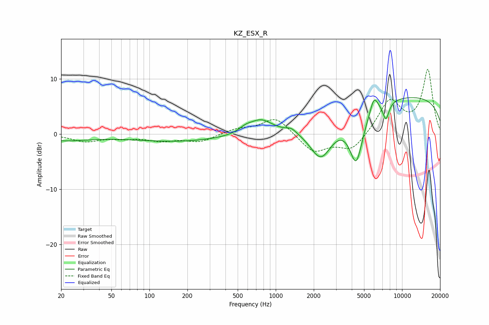

# KZ_ESX_R
See [usage instructions](https://github.com/jaakkopasanen/AutoEq#usage) for more options and info.

### Parametric EQs
Apply preamp of -6.7 dB when using parametric equalizer.

|   # | Type    |   Fc (Hz) |    Q |   Gain (dB) |
|-----|---------|-----------|------|-------------|
|   1 | Peaking |        21 | 0.67 |        -1.1 |
|   2 | Peaking |       173 | 0.37 |        -1.3 |
|   3 | Peaking |       577 | 2.66 |         0.8 |
|   4 | Peaking |       763 | 1.61 |         2.4 |
|   5 | Peaking |      1330 | 3.68 |         0.7 |
|   6 | Peaking |      2281 | 1.48 |        -7.2 |
|   7 | Peaking |      4335 | 2.52 |        -9.5 |
|   8 | Peaking |      5989 | 4.43 |         2.9 |
|   9 | Peaking |      7447 | 5.32 |        -3.2 |
|  10 | Peaking |     10000 | 0.18 |         7   |

### Fixed Band EQs
When using fixed band (also called graphic) equalizer, apply preamp of **-11.8 dB** (if available) and set gains manually with these parameters.

|   # | Type    |   Fc (Hz) |    Q |   Gain (dB) |
|-----|---------|-----------|------|-------------|
|   1 | Peaking |        31 | 1.41 |        -1.3 |
|   2 | Peaking |        62 | 1.41 |        -0.6 |
|   3 | Peaking |       125 | 1.41 |        -1.1 |
|   4 | Peaking |       250 | 1.41 |        -1.3 |
|   5 | Peaking |       500 | 1.41 |         0.9 |
|   6 | Peaking |      1000 | 1.41 |         3.1 |
|   7 | Peaking |      2000 | 1.41 |        -3.3 |
|   8 | Peaking |      4000 | 1.41 |        -3   |
|   9 | Peaking |      8000 | 1.41 |         6.1 |
|  10 | Peaking |     16000 | 1.41 |        11.5 |

### Graphs

