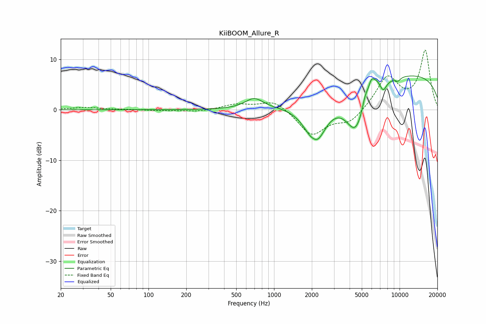

# KiiBOOM_Allure_R
See [usage instructions](https://github.com/jaakkopasanen/AutoEq#usage) for more options and info.

### Parametric EQs
Apply preamp of -6.8 dB when using parametric equalizer.

|   # | Type    |   Fc (Hz) |    Q |   Gain (dB) |
|-----|---------|-----------|------|-------------|
|   1 | Peaking |       694 | 1.99 |         2.1 |
|   2 | Peaking |      2100 | 3.59 |         2.4 |
|   3 | Peaking |      2127 | 1.85 |       -10.7 |
|   4 | Peaking |      4473 | 1.65 |        -8.9 |
|   5 | Peaking |      5317 | 5.89 |         2   |
|   6 | Peaking |      5950 | 5.4  |         2.7 |
|   7 | Peaking |      6515 | 3.84 |         1.5 |
|   8 | Peaking |      7416 | 5.34 |        -1.8 |
|   9 | Peaking |      9690 | 6    |        -0.7 |
|  10 | Peaking |     10000 | 0.19 |         7.2 |

### Fixed Band EQs
When using fixed band (also called graphic) equalizer, apply preamp of **-11.9 dB** (if available) and set gains manually with these parameters.

|   # | Type    |   Fc (Hz) |    Q |   Gain (dB) |
|-----|---------|-----------|------|-------------|
|   1 | Peaking |        31 | 1.41 |         0.5 |
|   2 | Peaking |        62 | 1.41 |         0.1 |
|   3 | Peaking |       125 | 1.41 |        -0.2 |
|   4 | Peaking |       250 | 1.41 |        -0.4 |
|   5 | Peaking |       500 | 1.41 |         1.1 |
|   6 | Peaking |      1000 | 1.41 |         2   |
|   7 | Peaking |      2000 | 1.41 |        -5   |
|   8 | Peaking |      4000 | 1.41 |        -2.5 |
|   9 | Peaking |      8000 | 1.41 |         6.4 |
|  10 | Peaking |     16000 | 1.41 |        11.6 |

### Graphs

