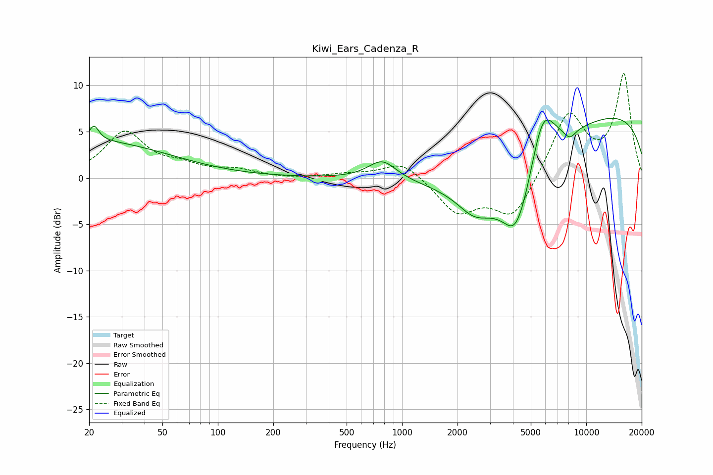

# Kiwi_Ears_Cadenza_R
See [usage instructions](https://github.com/jaakkopasanen/AutoEq#usage) for more options and info.

### Parametric EQs
Apply preamp of -6.5 dB when using parametric equalizer.

|   # | Type    |   Fc (Hz) |    Q |   Gain (dB) |
|-----|---------|-----------|------|-------------|
|   1 | Peaking |        20 | 0.32 |         4   |
|   2 | Peaking |        21 | 5.63 |         1.6 |
|   3 | Peaking |       781 | 1.85 |         2.1 |
|   4 | Peaking |      2471 | 1.55 |        -2.2 |
|   5 | Peaking |      3578 | 0.47 |        -6.2 |
|   6 | Peaking |      4045 | 3.12 |        -1   |
|   7 | Peaking |      4304 | 1.52 |        -6   |
|   8 | Peaking |      5785 | 1.9  |         7   |
|   9 | Peaking |      8145 | 4.03 |        -1   |
|  10 | Peaking |      9976 | 0.18 |         7.6 |

### Fixed Band EQs
When using fixed band (also called graphic) equalizer, apply preamp of **-11.4 dB** (if available) and set gains manually with these parameters.

|   # | Type    |   Fc (Hz) |    Q |   Gain (dB) |
|-----|---------|-----------|------|-------------|
|   1 | Peaking |        31 | 1.41 |         4.8 |
|   2 | Peaking |        62 | 1.41 |         1   |
|   3 | Peaking |       125 | 1.41 |         0.8 |
|   4 | Peaking |       250 | 1.41 |        -0.1 |
|   5 | Peaking |       500 | 1.41 |         0.4 |
|   6 | Peaking |      1000 | 1.41 |         1.9 |
|   7 | Peaking |      2000 | 1.41 |        -3.7 |
|   8 | Peaking |      4000 | 1.41 |        -4.4 |
|   9 | Peaking |      8000 | 1.41 |         7   |
|  10 | Peaking |     16000 | 1.41 |        11   |

### Graphs

