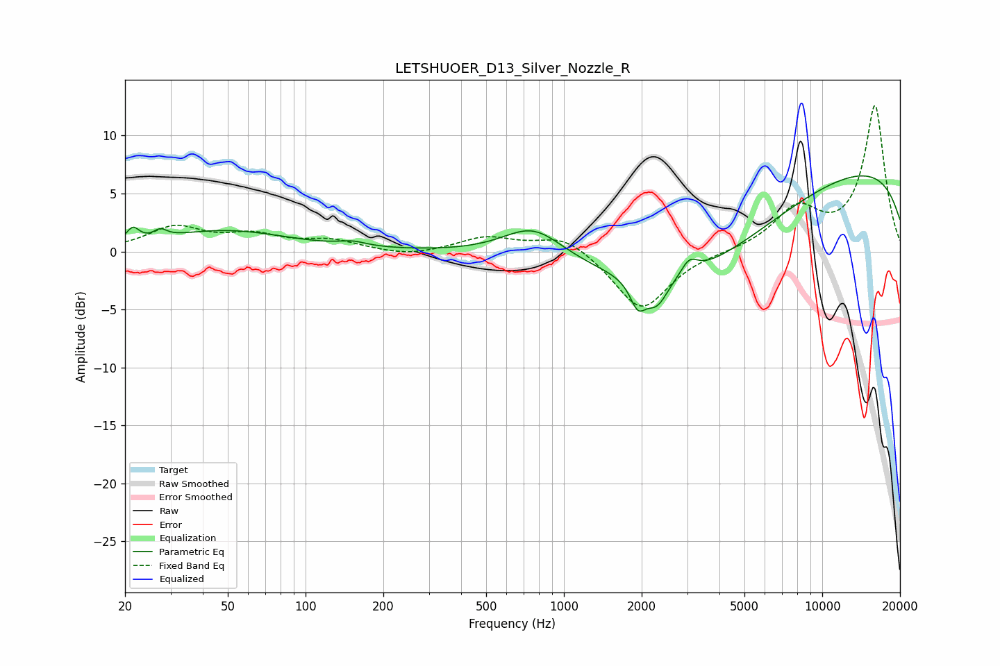

# LETSHUOER_D13_Silver_Nozzle_R
See [usage instructions](https://github.com/jaakkopasanen/AutoEq#usage) for more options and info.

### Parametric EQs
Apply preamp of -6.6 dB when using parametric equalizer.

|   # | Type    |   Fc (Hz) |    Q |   Gain (dB) |
|-----|---------|-----------|------|-------------|
|   1 | Peaking |        21 | 5.96 |         1.2 |
|   2 | Peaking |        27 | 5.8  |         0.7 |
|   3 | Peaking |        49 | 0.58 |         1.8 |
|   4 | Peaking |       152 | 2.66 |         0.4 |
|   5 | Peaking |       762 | 1.2  |         2.8 |
|   6 | Peaking |      1933 | 4.67 |        -2.3 |
|   7 | Peaking |      2290 | 3.23 |        -2.3 |
|   8 | Peaking |      3057 | 4.4  |         1.3 |
|   9 | Peaking |      3255 | 0.4  |        -7   |
|  10 | Peaking |     10000 | 0.18 |         8   |

### Fixed Band EQs
When using fixed band (also called graphic) equalizer, apply preamp of **-12.7 dB** (if available) and set gains manually with these parameters.

|   # | Type    |   Fc (Hz) |    Q |   Gain (dB) |
|-----|---------|-----------|------|-------------|
|   1 | Peaking |        31 | 1.41 |         2   |
|   2 | Peaking |        62 | 1.41 |         1.2 |
|   3 | Peaking |       125 | 1.41 |         0.9 |
|   4 | Peaking |       250 | 1.41 |        -0.5 |
|   5 | Peaking |       500 | 1.41 |         1.2 |
|   6 | Peaking |      1000 | 1.41 |         1.5 |
|   7 | Peaking |      2000 | 1.41 |        -5.1 |
|   8 | Peaking |      4000 | 1.41 |        -0   |
|   9 | Peaking |      8000 | 1.41 |         3.5 |
|  10 | Peaking |     16000 | 1.41 |        12.5 |

### Graphs

