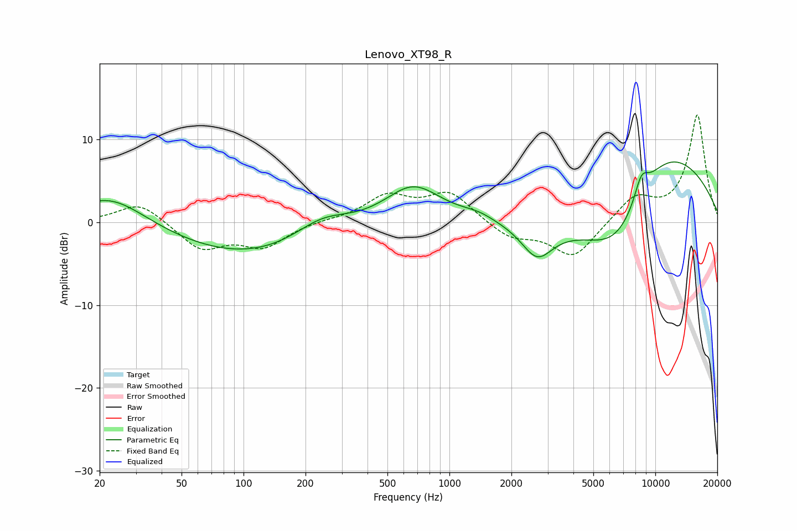

# Lenovo_XT98_R
See [usage instructions](https://github.com/jaakkopasanen/AutoEq#usage) for more options and info.

### Parametric EQs
Apply preamp of -7.4 dB when using parametric equalizer.

|   # | Type    |   Fc (Hz) |    Q |   Gain (dB) |
|-----|---------|-----------|------|-------------|
|   1 | Peaking |        20 | 5.38 |        -0   |
|   2 | Peaking |        23 | 0.82 |         3.6 |
|   3 | Peaking |       110 | 0.37 |        -4.2 |
|   4 | Peaking |       240 | 1    |         2.6 |
|   5 | Peaking |       665 | 1.02 |         4.6 |
|   6 | Peaking |      1376 | 1.78 |         0.7 |
|   7 | Peaking |      2667 | 1.85 |        -4   |
|   8 | Peaking |      6609 | 0.61 |       -11.9 |
|   9 | Peaking |      8551 | 3.76 |         2.8 |
|  10 | Peaking |     10000 | 0.41 |        13.5 |

### Fixed Band EQs
When using fixed band (also called graphic) equalizer, apply preamp of **-13.1 dB** (if available) and set gains manually with these parameters.

|   # | Type    |   Fc (Hz) |    Q |   Gain (dB) |
|-----|---------|-----------|------|-------------|
|   1 | Peaking |        31 | 1.41 |         2.5 |
|   2 | Peaking |        62 | 1.41 |        -3.2 |
|   3 | Peaking |       125 | 1.41 |        -2.8 |
|   4 | Peaking |       250 | 1.41 |         0.2 |
|   5 | Peaking |       500 | 1.41 |         3   |
|   6 | Peaking |      1000 | 1.41 |         3.5 |
|   7 | Peaking |      2000 | 1.41 |        -1.9 |
|   8 | Peaking |      4000 | 1.41 |        -4.3 |
|   9 | Peaking |      8000 | 1.41 |         3   |
|  10 | Peaking |     16000 | 1.41 |        13   |

### Graphs

