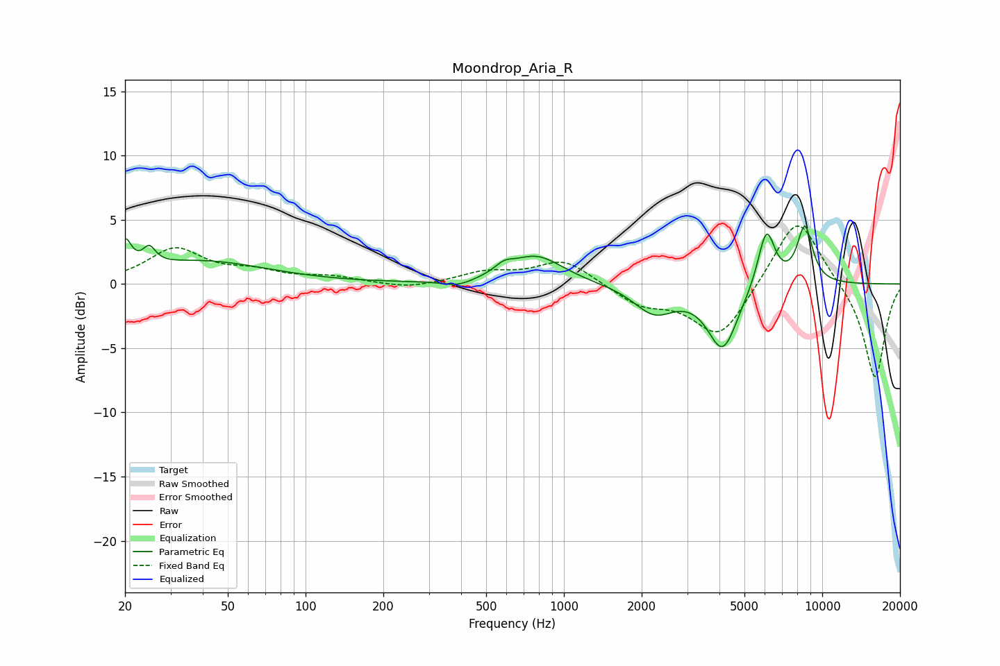

# Moondrop_Aria_R
See [usage instructions](https://github.com/jaakkopasanen/AutoEq#usage) for more options and info.

### Parametric EQs
Apply preamp of -4.6 dB when using parametric equalizer.

|   # | Type    |   Fc (Hz) |    Q |   Gain (dB) |
|-----|---------|-----------|------|-------------|
|   1 | Peaking |        20 | 5.89 |         2.3 |
|   2 | Peaking |        25 | 5.8  |         1.3 |
|   3 | Peaking |        39 | 0.55 |         1.8 |
|   4 | Peaking |       389 | 2.41 |        -0.5 |
|   5 | Peaking |       586 | 4.01 |         0.6 |
|   6 | Peaking |       781 | 1.36 |         2.2 |
|   7 | Peaking |      2237 | 1.77 |        -2.2 |
|   8 | Peaking |      4119 | 2.38 |        -5   |
|   9 | Peaking |      6079 | 4.07 |         4.6 |
|  10 | Peaking |      8563 | 4.24 |         4.4 |

### Fixed Band EQs
When using fixed band (also called graphic) equalizer, apply preamp of **-4.6 dB** (if available) and set gains manually with these parameters.

|   # | Type    |   Fc (Hz) |    Q |   Gain (dB) |
|-----|---------|-----------|------|-------------|
|   1 | Peaking |        31 | 1.41 |         2.7 |
|   2 | Peaking |        62 | 1.41 |         0.8 |
|   3 | Peaking |       125 | 1.41 |         0.5 |
|   4 | Peaking |       250 | 1.41 |        -0.4 |
|   5 | Peaking |       500 | 1.41 |         0.9 |
|   6 | Peaking |      1000 | 1.41 |         1.9 |
|   7 | Peaking |      2000 | 1.41 |        -1.5 |
|   8 | Peaking |      4000 | 1.41 |        -4.2 |
|   9 | Peaking |      8000 | 1.41 |         5.6 |
|  10 | Peaking |     16000 | 1.41 |        -7.5 |

### Graphs

